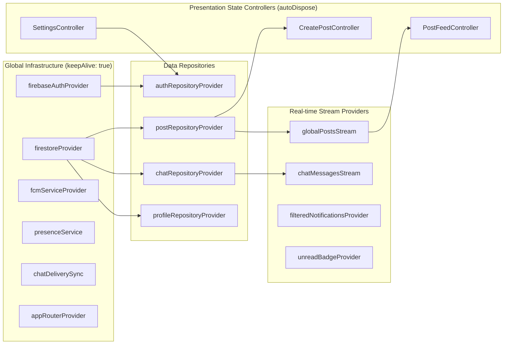
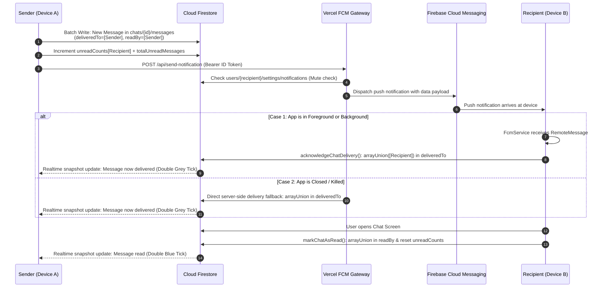

# RUN Campus Connect — System Architecture & Design

This document details the architectural design, layer boundaries, dependency patterns, communication mechanisms, and data flows within the **RUN Campus Connect** ecosystem.

---

## 1. System Topology & Tier Architecture

RUN Campus Connect employs a hybrid multi-tier architecture combining cross-platform native client execution, Firebase backend-as-a-service (BaaS), specialized serverless compute functions, and an on-premise/containerized Python microservice.

```mermaid
graph TD
    subgraph Client ["Client Layer (Flutter Cross-Platform)"]
        Flutter["Flutter Engine (Dart 3.7+)"]
        HiveBox["Hive Storage Engine (feed_cache, download_engine)"]
        NativeJNI["Android JNI C++ Hook (libhpatchz.so)"]
        Flutter --- HiveBox
        Flutter --- NativeJNI
    end

    subgraph FirebasePlatform ["Cloud Infrastructure (Firebase BaaS)"]
        FirebaseAuth["Firebase Auth (OAuth & Synthetic Accounts)"]
        Firestore["Cloud Firestore (Real-Time Document Store)"]
        FCM["Firebase Cloud Messaging (FCM Push Engine)"]
        RemoteConfig["Firebase Remote Config (Rollout & Version Gate)"]
        PerfAnalytics["Firebase Performance & Analytics"]
    end

    subgraph ComputeNodes ["Compute & Microservices Layer"]
        FastAPI["Python FastAPI Verification Service (EasyOCR + PyTorch)"]
        VercelGateway["Vercel Serverless Function Gateway (Node.js 18)"]
    end

    subgraph ExternalServices ["External CDNs & Upstream"]
        Cloudinary["Cloudinary CDN (Post Images, Avatars, Temp Docs)"]
        Shorebird["Shorebird Cloud (Dart Runtime OTA Patches)"]
    end

    Flutter -->|"Auth Tokens & Sessions"| FirebaseAuth
    Flutter -->|"Real-time Streams & Transactions"| Firestore
    Flutter -->|"Token Registration & Incoming Alerts"| FCM
    Flutter -->|"Fetch Configuration Flags"| RemoteConfig
    Flutter -->|"Emit Traces & User Metrics"| PerfAnalytics
    Flutter -->|"Upload Media Assets"| Cloudinary
    Flutter -->|"Trigger Background Push"| VercelGateway
    Flutter -->|"Submit Admission Documents"| FastAPI
    Flutter -->|"Pull OTA Code Patches"| Shorebird

    VercelGateway -->|"Admin Token Push Delivery"| FCM
    VercelGateway -->|"Query Mute Lists & Mark Delivered"| Firestore
    VercelGateway -->|"Purge Old Post Images"| Cloudinary

    FastAPI -->|"Verify JAMB & Flag isVerified"| Firestore
    FastAPI -->|"Delete Uploaded Documents"| Cloudinary
```



---

## 2. Flutter Client Architecture

The mobile application follows **Feature-First Clean Architecture**, ensuring modularity, clear separation of concerns, testability, and isolated feature boundaries.

```
lib/
├── app.dart                   # Root MaterialApp.router & global auth listener
├── firebase_options.dart      # Platform-specific Firebase credentials
├── main.dart                  # Application bootstrap, background handlers, Hive init
├── core/                      # Cross-cutting foundational infrastructure
│   ├── config/                # API, App, and Cloudinary configuration constants
│   ├── constants/             # Spacing constants and university faculty/dept mappings
│   ├── providers/             # Firebase singleton provider definitions
│   ├── services/              # FCM, Delivery sync, Presence, Updates, Analytics, Birthday
│   ├── theme/                 # Light/Dark brand themes and theme state controller
│   └── widgets/               # Reusable UI primitives (Shimmer, Overlays, Image viewer)
├── router/                    # Declarative GoRouter routing & auth redirects
│   ├── app_router.dart        # Route definitions & StatefulShellRoute shell
│   ├── auth_redirect.dart     # Route guarding state machine
│   └── widgets/app_shell.dart # Bottom navigation bar shell container
└── features/                  # Domain-specific feature modules
    ├── auth/                  # Authentication, fresher registration & email verification
    ├── chat/                  # 1-on-1 direct messaging, read receipts & delivery ack
    ├── explore/               # Institutional information, university news & user search
    ├── home/                  # Multi-tab social feed shell container
    ├── notifications/         # In-app notification center & unread badge provider
    ├── posts/                 # Post creation, feeds, likes, comments & view tracking
    ├── profile/               # User profile display, editing, and timeline
    ├── settings/              # User preferences, feedback submission & admin review
    └── update/                # Update center page & manual package installer
```

### Clean Architecture Layers per Feature

Each feature directory within `lib/features/` is strictly divided into three sub-layers:

```
features/<feature_name>/
├── domain/         # Pure business logic: Immutable models, entities, and enums
├── data/           # Data access: Repositories, Firestore queries, API integrations
└── presentation/   # UI layer: Screens, widgets, and Riverpod Notifiers/Controllers
```

1. **Domain Layer**:
   - Contains immutable Dart data classes representing core entities (`UserProfile`, `Post`, `ChatMessage`, `Comment`, `NotificationItem`, `PostVisibility`).
   - Completely decoupled from Flutter UI widgets and framework code.
   - Responsible for data transformation, serialization (`toMap`, `fromMap`, `fromSnapshot`), and pure business computations (such as formatted birthday strings with ordinal suffixes).

2. **Data Layer**:
   - Contains repository classes (e.g., `PostRepository`, `ChatRepository`, `AuthRepository`, `ProfileRepository`, `FeedbackRepository`).
   - Encapsulates all Firestore transactions, batched writes, query builders, Cloudinary upload calls, and external HTTP interactions.
   - Exposes clean Dart Streams and Futures to the presentation layer, shielding UI components from raw database access.

3. **Presentation Layer**:
   - Comprises Flutter `StatelessWidget`, `StatefulWidget`, and `ConsumerWidget` implementations.
   - Uses Riverpod `AsyncNotifier` or `StateNotifier` controllers (e.g., `CreatePostController`, `PostFeedController`, `ProfileController`, `SettingsController`, `LoginController`).
   - Manages UI states (`AsyncLoading`, `AsyncData`, `AsyncError`) and reacts to user input.

---

## 3. State Management Architecture (Riverpod 2.x)

The application utilizes **Flutter Riverpod 2.x** with annotation-based code generation (`riverpod_annotation` and `riverpod_generator`).

### Provider Topology & Classifications



### Key Provider Categories

| Provider Category | Example Providers | Lifecycle Behavior | Purpose |
| :--- | :--- | :--- | :--- |
| **External Singletons** | `firebaseAuthProvider`, `firestoreProvider`, `firebaseMessagingProvider` | `@Riverpod(keepAlive: true)` | Provides thread-safe, consistent access to external SDK instances. |
| **Repositories** | `postRepositoryProvider`, `chatRepositoryProvider`, `authRepositoryProvider` | `@Riverpod(keepAlive: true)` | Stateless singletons managing Firestore transactions and business logic. |
| **Real-time Streams** | `globalPostsStream`, `facultyPostsStream`, `unreadBadgeProvider` | Auto-disposed or keepAlive | Listen directly to Firestore query snapshots and emit reactive entity lists. |
| **UI State Notifiers** | `CreatePostController`, `SettingsController`, `ProfileController` | `@riverpod` (auto-disposed) | Manage asynchronous UI operations, loading states, and error handling via `AsyncValue.guard`. |

### Code Generation Workflow
All annotated providers generate companion code in `*.g.dart` files. Whenever providers or models are added or modified:

```bash
dart run build_runner build --delete-conflicting-outputs
```

---

## 4. Navigation Architecture & Route Guards

Navigation is driven by **`go_router` 14.x**, utilizing declarative configuration with a centralized authorization state machine (`resolveAuthRedirect`).

### Navigation Hierarchy Diagram

```mermaid
flowchart TD
    Req[Incoming Navigation Route] --> Wrapper[UpdateCheckWrapper Shell]
    Wrapper --> AuthCheck{Is User Logged In?}

    AuthCheck -->|No| AuthGate{Target Route in Public Auth White-list?}
    AuthGate -->|Yes| PublicRoute[Login / Fresher Auth Screens]
    AuthGate -->|No| ToLogin[Redirect to /login]

    AuthCheck -->|Yes| ProfileCheck{Firestore users/{uid} Exists & Has displayName?}
    ProfileCheck -->|No| ToProfile[Redirect to /create-profile]
    ProfileCheck -->|Yes| VerificationCheck{Account Verified?}

    VerificationCheck -->|Standard User Unverified| ToVerifyEmail[Redirect to /verify-email]
    VerificationCheck -->|Fresher Unverified| ToPending[Redirect to /pending-verification]
    VerificationCheck -->|Verified| TargetCheck{Is Route on Auth Screen?}

    TargetCheck -->|Yes| ToHome[Redirect to /home]
    TargetCheck -->|No| AppShellContainer[AppShell: StatefulShellRoute]

    AppShellContainer --> Tab0[Tab 0: /home Social Feed]
    AppShellContainer --> Tab1[Tab 1: /explore Institutional Hub]
    AppShellContainer --> Tab2[Tab 2: /notifications In-App Alerts]
    AppShellContainer --> Tab3[Tab 3: /profile User Profile]
```

### Route Guarding Logic (`auth_redirect.dart`)

The redirection engine executes on every routing event and evaluates five rules in strict order:

1. **Update Center Bypass**: `/update-center` is exempt from authentication to allow forced update recovery even if an expired user session exists.
2. **Unauthenticated Access**: Any request to protected routes without a Firebase Auth session redirects to `/`.
3. **Incomplete Profile Gate**: Users signed in via Google or email without a fully populated `displayName` in `users/{uid}` are redirected to `/create-profile`.
4. **Verification Gate**:
   - Standard `@run.edu.ng` users with `emailVerified == false` are redirected to `/verify-email`.
   - Fresher accounts (`role == 'fresher'`) with `isVerified == false` are redirected to `/pending-verification`.
5. **Reverse Auth Guard**: Authenticated and verified users navigating to `/`, `/verify-email`, or fresher authentication pages are redirected to `/home`.

### Shell Navigation (`AppShell`)
The main application shell uses `StatefulShellRoute.indexedStack`. This ensures that each tab (`Home`, `Explore`, `Notifications`, `Profile`) maintains its own independent navigation stack and scroll position when switching between bottom navigation tabs.

---

## 5. Real-Time Data Synchronization & Delivery Engine

One of the platform's core architectural innovations is its WhatsApp-style message delivery acknowledgement and real-time synchronization system.



### Multi-Tier Delivery Assurance Mechanisms

1. **Persistent Real-Time Sync (`ChatDeliverySync`)**:
   - While the app is active, `ChatDeliverySync` maintains an active Firestore listener on `chats` where `participants array-contains user.uid`.
   - When any chat changes with `unreadCounts[user.uid] > 0`, it immediately executes `acknowledgeChatDelivery` to add the recipient UID to `deliveredTo`.
2. **Push Delivery Acknowledgement (`chat_delivery_ack.dart`)**:
   - When an FCM data push arrives (even in background isolate via `_firebaseMessagingBackgroundHandler`), the top-level callback parses the `chatId` and `messageId` and updates Firestore before displaying or suppressing the notification.
3. **Server-Side Fallback (`send-notification.js`)**:
   - If the recipient's device accepts the FCM message, the Vercel serverless function directly appends the recipient UID to `deliveredTo` in Firestore, guaranteeing that offline or killed devices still register message delivery.
4. **Presence Heartbeat Sweep (`PresenceService`)**:
   - When a user transitions from offline to online (`AppLifecycleState.resumed`), `presenceService.onOnline` triggers `markAllChatsDelivered`, sweeping any messages that arrived while disconnected.

---

## 6. Dual Application Update System

RUN Campus Connect implements an enterprise-grade dual update strategy to handle both zero-downtime hot patches and native binary upgrades.

```mermaid
graph TD
    AppStart[Application Launch] --> RC[Fetch Remote Config]
    RC --> Parse[Parse min_version, patch_url, update_url, rollout_percentage]

    Parse --> VersionComp{current_version < min_version?}
    VersionComp -->|Yes| RolloutCheck{User in Rollout Bucket?<br/>MD5(uid) % 100 < rollout}
    RolloutCheck -->|Yes| GapCheck{Version Gap ≥ 2?}
    GapCheck -->|Yes (e.g. 1.0.0 to 1.0.2)| FullAPK[PackageType: APK<br/>UpdateRequiredDialog / Force APK Download]
    GapCheck -->|No (e.g. 1.0.1 to 1.0.2)| BinaryDelta[PackageType: Patch<br/>Download diff.patch & invoke native hpatchz]

    RolloutCheck -->|No| ShorebirdCheck
    VersionComp -->|No| ShorebirdCheck{Shorebird Patch Available?}
    ShorebirdCheck -->|Yes| OTA[Shorebird Code Push<br/>Background Dart Patch Download]
    ShorebirdCheck -->|No| NormalRun[Continue Normal App Execution]
```

### 1. Shorebird Over-The-Air (OTA) Code Push
- Used for Dart-only hotfixes, UI adjustments, and business logic patches.
- Operates transparently in the background via `ShorebirdCodePush`.
- Does not require user confirmation or APK re-installation; patches take effect on the next application restart.

### 2. Native Binary Delta Patching (`hpatchz`)
- Used when native code, Gradle configurations, or platform dependencies are updated.
- Utilizes `HDiffPatch` differential compression algorithms. Instead of downloading a full 40MB+ APK over cellular networks, the client downloads a compact `diff.patch` file (typically 2–5MB).
- Calls native C++ code compiled into `libhpatchz.so` via Kotlin Android `MethodChannel` (`com.run.campus.connect/installer`). The native bridge applies the patch directly to the installed base APK (`/data/app/.../base.apk`) and generates a reconstructed target APK.
- Triggers standard Android package installer sessions via `PackageInstaller`.

### 3. Resilient Download Engine (`DownloadEngine`)
- Custom streaming HTTP engine implemented with `Dio` and Hive persistence.
- Features chunked byte-range resumption (`Range: bytes=X-`), exponential backoff retries, and network connectivity monitoring via `connectivity_plus`.
- Provides smoothed download speed calculations (exponential moving average) and estimated time of arrival (ETA).
- Integrates with `flutter_foreground_task` to run downloads inside an ongoing Android Foreground Service with notification progress bars.
- Enforces SHA-256 cryptographic checksum verification before any installation can occur.

---

## 7. Performance & Telemetry Architecture

The application embeds deep monitoring hooks across all critical execution paths:

### Firebase Performance Traces
Defined in `core/services/performance_service.dart`:
- `app_startup`: Measures elapsed milliseconds from `main()` binding capture to first frame rendering.
- `feed_refresh`: Measures network and deserialization latency when refreshing post streams.
- `message_send`: Measures the round-trip latency of Firestore batched message writes.

### Firebase Analytics Events
Defined in `core/services/analytics_service.dart`:
- Core user action metrics: `create_post`, `send_message`, `like_post`, `comment_post`, `directory_search`, `update_profile`, `view_feed`, `open_chat`.
- User engagement properties: `engaged_posting`, `engaged_messaging`, `engaged_search`.
- User identity tracking: `setUserId(user.uid)` tied to authentication lifecycle.
