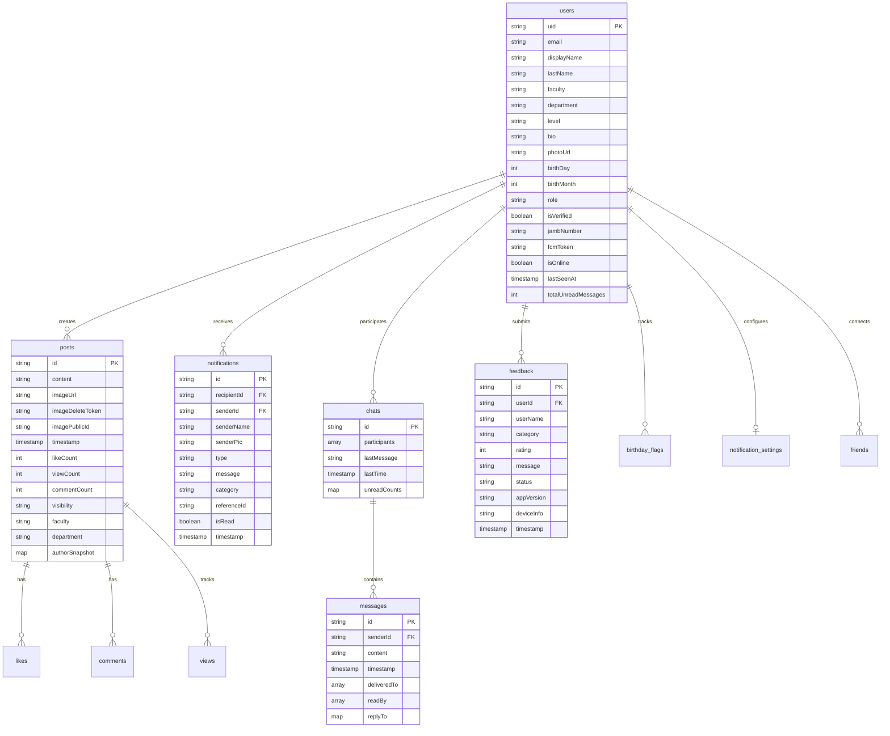

# RUN Campus Connect — Database Schema & Data Models

This document provides the definitive data model reference for **RUN Campus Connect**, covering Cloud Firestore collections, subcollections, document schemas, field types, Firebase Storage paths, local persistence engines (Hive and SharedPreferences), and indexing requirements.

---

## 1. Entity-Relationship Model (ERD)

The following diagram details the core entities, their subcollections, and relationship cardinality within Cloud Firestore:



---

## 2. Cloud Firestore Collections Reference

### 2.1 Collection: `users`
- **Document Path**: `users/{uid}` (keyed by Firebase Auth UID)
- **Description**: Stores student, staff, and fresher profile data, presence status, FCM device tokens, and aggregated badge counts.

| Field Name | Type | Nullable | Description / Constraints |
| :--- | :--- | :--- | :--- |
| `uid` | `string` | No | Matches Firebase Auth UID. |
| `email` | `string` | No | User email (`@run.edu.ng` or `{jamb}@fresher.run.edu.ng`). |
| `displayName` | `string` | No | Full display name (stored in UPPERCASE for search normalization). |
| `lastName` | `string` | Yes | Derived surname used for secondary directory search indexing. |
| `faculty` | `string` | No | Faculty name matching `RunUniversityData` constants. |
| `department` | `string` | No | Department name matching `RunUniversityData` constants. |
| `level` | `string` | Yes | Academic level (e.g., `"100"`, `"200"`, `"300"`, `"400"`, `"500"`). |
| `bio` | `string` | Yes | Personal status or bio (defaults to empty string `""`). |
| `photoUrl` | `string` | Yes | Public Cloudinary avatar URL. |
| `birthDay` | `int` | Yes | Day of birth (1–31). |
| `birthMonth` | `int` | Yes | Month of birth (1–12). |
| `createdAt` | `timestamp` | No | Server timestamp of account onboarding. |
| `role` | `string` | Yes | Set to `'fresher'` for prospective students; absent/null for regular students. |
| `isVerified` | `boolean` | Yes | Fresher OCR verification state (`false` initially, set to `true` by FastAPI). |
| `jambNumber` | `string` | Yes | Normalized uppercase JAMB registration number (freshers only). |
| `fcmToken` | `string` | Yes | Active device Firebase Cloud Messaging registration token. |
| `fcmTokenUpdatedAt`| `timestamp` | Yes | Timestamp when `fcmToken` was last refreshed. |
| `isOnline` | `boolean` | No | Active user presence flag maintained by `PresenceService`. |
| `lastSeenAt` | `timestamp` | No | Timestamp of latest heartbeat or disconnect. |
| `totalUnreadMessages`| `int` | No | Aggregate unread counter across all chats driving the bottom bar badge. |

#### Subcollection: `users/{uid}/birthday_flags`
- **Document Path**: `users/{uid}/birthday_flags/{dateKey}`
- **Document ID**: Date key in `YYYY-MM-DD` format (e.g. `2026-06-06`).
- **Description**: Prevents the birthday bot from sending duplicate greeting messages on the same calendar day.

| Field Name | Type | Description |
| :--- | :--- | :--- |
| `sentAt` | `timestamp` | Server timestamp when the birthday greeting bot message was dispatched. |

#### Subcollection: `users/{uid}/settings`
- **Document Path**: `users/{uid}/settings/notifications`
- **Description**: User notification preferences and muted sender lists.

| Field Name | Type | Description |
| :--- | :--- | :--- |
| `mutedUsers` | `array<string>` | List of user UIDs whose direct chat push notifications are silenced. |

#### Subcollection: `users/{uid}/friends`
- **Document Path**: `users/{uid}/friends/{friendId}`
- **Description**: Peer connections and contact relationships.

---

### 2.2 Collection: `posts`
- **Document Path**: `posts/{postId}` (auto-generated document ID)
- **Description**: Social feed posts supporting text, media attachments, denormalized author metadata, and atomic engagement counters.

| Field Name | Type | Nullable | Description / Constraints |
| :--- | :--- | :--- | :--- |
| `id` | `string` | No | Matches document ID. |
| `content` | `string` | No | Post text content. |
| `imageUrl` | `string` | Yes | Cloudinary CDN media URL. |
| `imageDeleteToken` | `string` | Yes | Cloudinary delete token for immediate unauthenticated client cleanup. |
| `imagePublicId` | `string` | Yes | Cloudinary asset public ID (e.g. `run_campus_posts/abc123`). |
| `timestamp` | `timestamp` | No | Creation timestamp used for feed ordering (`orderBy('timestamp', descending: true)`). |
| `likeCount` | `int` | No | Denormalized count of likes. |
| `viewCount` | `int` | No | Denormalized count of unique views. |
| `commentCount` | `int` | No | Denormalized count of comments. |
| `visibility` | `string` | No | `'public'` (global), `'faculty'`, or `'department'`. |
| `faculty` | `string` | No | Author's faculty at time of post creation. |
| `department` | `string` | No | Author's department at time of post creation. |
| `authorSnapshot` | `map` | No | Embedded author metadata to prevent N+1 queries. |

#### `authorSnapshot` Schema
```json
{
  "uid": "string (author UID)",
  "name": "string (display name)",
  "dept": "string (department)",
  "photo": "string (photo URL)"
}
```

#### Subcollection: `posts/{postId}/likes`
- **Document Path**: `posts/{postId}/likes/{userId}`
- **Document ID**: Liker's UID (enforces strict 1-like-per-user constraint).

| Field Name | Type | Description |
| :--- | :--- | :--- |
| `timestamp` | `timestamp` | Timestamp when the post was liked. |

#### Subcollection: `posts/{postId}/views`
- **Document Path**: `posts/{postId}/views/{viewerUid}`
- **Document ID**: Viewer's UID (enforces strict 1-unique-view-per-user constraint).

| Field Name | Type | Description |
| :--- | :--- | :--- |
| `viewedAt` | `timestamp` | Timestamp when the user first viewed the post. |

#### Subcollection: `posts/{postId}/comments`
- **Document Path**: `posts/{postId}/comments/{commentId}`
- **Document ID**: Auto-generated.

| Field Name | Type | Description |
| :--- | :--- | :--- |
| `content` | `string` | Comment text content. |
| `authorId` | `string` | Commenter UID. |
| `authorName` | `string` | Commenter display name snapshot. |
| `authorPhoto`| `string` | Commenter photo URL snapshot. |
| `timestamp` | `timestamp` | Timestamp when the comment was submitted. |

---

### 2.3 Collection: `chats`
- **Document Path**: `chats/{chatId}`
- **Document ID**: Deterministic combination of participant UIDs: `uid1_uid2` (where `uid1 < uid2`).
- **Description**: Direct message channel metadata and inbox ordering index.

| Field Name | Type | Description |
| :--- | :--- | :--- |
| `participants` | `array<string>` | Exactly two user UIDs participating in the chat. |
| `lastMessage` | `string` | Text preview of the most recent message. |
| `lastTime` | `timestamp` | Timestamp of the most recent message (inbox sort key). |
| `unreadCounts` | `map<string, int>` | Map of `{ [uid]: unreadCount }` tracking unread messages per participant. |
| `participantNames` | `map<string, string>` | Optional UID → display name map for inbox rendering. |
| `participantPhotos`| `map<string, string>` | Optional UID → avatar URL map for inbox rendering. |

#### Subcollection: `chats/{chatId}/messages`
- **Document Path**: `chats/{chatId}/messages/{messageId}`
- **Document ID**: Auto-generated.
- **Description**: Individual chat message entities.

| Field Name | Type | Nullable | Description / Constraints |
| :--- | :--- | :--- | :--- |
| `senderId` | `string` | No | UID of the sending user. |
| `content` | `string` | No | Text content of the message. |
| `timestamp` | `timestamp` | No | Server timestamp (`FieldValue.serverTimestamp()`). |
| `deliveredTo`| `array<string>` | No | UIDs of users whose devices have received the message (double grey tick). |
| `readBy` | `array<string>` | No | UIDs of users who have actively opened the chat (double blue tick). |
| `replyTo` | `map` | Yes | Quoted message preview metadata. |

#### `replyTo` Schema
```json
{
  "messageId": "string (original message ID)",
  "content": "string (quoted text snippet)",
  "senderName": "string (original author name)"
}
```

---

### 2.4 Collection: `notifications`
- **Document Path**: `notifications/{notificationId}`
- **Description**: In-app notifications generated for user events (e.g., new posts in faculty/department).

| Field Name | Type | Description |
| :--- | :--- | :--- |
| `recipientId` | `string` | Target user UID receiving the notification. |
| `senderId` | `string` | UID of the user who triggered the event. |
| `senderName` | `string` | Display name snapshot of the sender. |
| `senderPic` | `string` | Avatar photo URL snapshot of the sender. |
| `type` | `string` | Event type identifier (e.g. `'new_post'`, `'chat'`). |
| `message` | `string` | Human-readable notification preview text. |
| `category` | `string` | Filtering category: `'global'`, `'faculty'`, or `'department'`. |
| `referenceId` | `string` | Target document ID (e.g. `postId`). |
| `isRead` | `boolean` | Read status flag (`false` by default). |
| `timestamp` | `timestamp` | Server timestamp of notification creation. |

---

### 2.5 Collection: `feedback`
- **Document Path**: `feedback/{feedbackId}`
- **Description**: User-submitted feedback and bug reports reviewed by system administrators.

| Field Name | Type | Description |
| :--- | :--- | :--- |
| `userId` | `string` | Submitter Firebase Auth UID. |
| `userName` | `string` | Submitter display name. |
| `category` | `string` | Feedback category (`'Bug'`, `'Feature Request'`, `'UI/UX'`, `'General'`). |
| `rating` | `int` | Star rating (1 to 5). |
| `message` | `string` | User feedback description. |
| `status` | `string` | Administrative triage status: `'pending'`, `'reviewed'`, `'resolved'`. |
| `appVersion` | `string` | Client version string (e.g. `'1.0.0+4'`). |
| `deviceInfo` | `string` | Device model and OS platform metadata. |
| `timestamp` | `timestamp` | Server timestamp of feedback creation. |

---

### 2.6 Institutional Collections (Scraper Synchronized)

These collections are populated and updated by automated background web crawlers targeting `run.edu.ng`:

#### 1. `run_news`
- **Document Path**: `run_news/{newsId}` (hash-based document ID for deduplication)
- **Fields**:
  - `url`: (`string`) Original news article URL.
  - `heading`: (`string`) News headline title.
  - `imageUrl`: (`string`) Featured article header image.
  - `fullPost`: (`string`) Full article plain text body.
  - `scrapedAt`: (`timestamp`) Timestamp when the article was scraped.

#### 2. `run_our_history`
- **Document Path**: `run_our_history/our_history` (single document)
- **Fields**:
  - `url`: (`string`) Page URL (`https://run.edu.ng/our-history/`).
  - `fullHistory`: (`string`) Full university historical narrative.
  - `imageUrls`: (`array<string>`) Gallery of historical university images.
  - `scrapedAt`: (`timestamp`) Sync timestamp.

#### 3. `run_governance`
- **Document Path**: `run_governance/governance` (single document)
- **Fields**:
  - `url`: (`string`) Page URL (`https://run.edu.ng/governance/`).
  - `teamMembers`: (`array<map>`) Principal officers (`name`, `role`, `imageUrl`, `bio`).
  - `boardOfTrustees`: (`array<map>`) Board members (`name`, `role`).
  - `governingCouncil`: (`array<map>`) Council members (`name`, `role`).
  - `senateMembers`: (`array<map>`) Senate members (`name`, `position`).
  - `scrapedAt`: (`timestamp`) Sync timestamp.

#### 4. `run_vision_mission`
- **Document Path**: `run_vision_mission/vision_mission` (single document)
- **Fields**:
  - `url`: (`string`) Page URL (`https://run.edu.ng/vision-mission-strategy/`).
  - `visionStatement`: (`string`) Official university vision quote.
  - `missionStatement`: (`string`) Official university mission quote.
  - `visionStrategy`: (`string`) 10-year institutional strategic plan text.
  - `scrapedAt`: (`timestamp`) Sync timestamp.

#### 5. `run_motto_logo_anthem`
- **Document Path**: `run_motto_logo_anthem/motto_logo_anthem` (single document)
- **Fields**:
  - `url`: (`string`) Page URL (`https://run.edu.ng/motto-logo-anthem/`).
  - `fullContent`: (`string`) University motto, crest description, and anthem lyrics.
  - `imageUrls`: (`array<string>`) High-resolution university crest images.
  - `scrapedAt`: (`timestamp`) Sync timestamp.

---

## 3. Firebase Storage Bucket Hierarchy

Configured in `storage.rules`:

```
gs://run-campus-connect.appspot.com/
├── users/
│   └── {uid}/
│       └── profile.jpg                  # User profile avatar image
└── posts/
    └── {uid}/
        └── {timestamp}.jpg              # User post media attachment
```

- **Access Rules**:
  - Read: Public for all profile and post photos.
  - Write: Restricted strictly to the authenticated owner (`request.auth.uid == uid`).

---

## 4. Local Client Storage Schemas

### 4.1 Hive Storage Boxes (`hive_flutter`)

The mobile client maintains two high-performance local NoSQL Hive boxes:

#### Box 1: `feed_cache`
- **Type**: `Box<dynamic>`
- **Purpose**: Persists recently loaded post snapshots to enable instant offline rendering and eliminate layout jumping on app startup.

#### Box 2: `download_engine`
- **Type**: `Box<dynamic>`
- **Key**: `'state'`
- **Schema**:
```json
{
  "url": "https://.../full_update.apk",
  "destination": "/data/user/0/.../full_update.apk",
  "expectedSha256": "e3b0c44298fc1c149afbf4c8996fb92427ae41e4649b934ca495991b7852b855",
  "readyToInstallOnComplete": true,
  "downloaded": 15482910,
  "totalBytes": 45120892,
  "isDownloading": false,
  "isPaused": true,
  "pausedByNetwork": true,
  "isReadyToInstall": false
}
```

### 4.2 SharedPreferences Keys

| Key | Type | Description |
| :--- | :--- | :--- |
| `theme_mode` | `string` | User UI theme preference (`'light'`, `'dark'`, `'system'`). |
| `last_installed_version` | `string` | Last recorded app version (`version+buildNumber`) for detecting upgrades and preventing ghost patches. |
| `installAttemptVersion` | `string` | Version of package queued for installation. |
| `installAttemptBuildNumber` | `string` | Build number of package queued for installation. |
| `installAttemptAt` | `int` | Unix epoch milliseconds when the package installer was invoked. |

---

## 5. Firestore Composite Indexes

To support multi-field filtering and sorting, the following composite indexes are configured in Firestore:

| Collection | Indexed Fields & Order | Query Use Case |
| :--- | :--- | :--- |
| `posts` | `visibility` ASC, `timestamp` DESC | Global Feed queries |
| `posts` | `visibility` ASC, `faculty` ASC, `timestamp` DESC | Faculty Feed queries |
| `posts` | `visibility` ASC, `department` ASC, `timestamp` DESC | Department Feed queries |
| `chats` | `participants` ARRAY-CONTAINS, `lastTime` DESC | User Inbox sorting |
| `notifications` | `recipientId` ASC, `timestamp` DESC | In-app notification center |
| `notifications` | `recipientId` ASC, `category` ASC, `timestamp` DESC | Category filtered notification tabs |
| `run_news` | `scrapedAt` ASC | News carousel ordering |
| `feedback` | `timestamp` DESC | Admin feedback triage queue |
