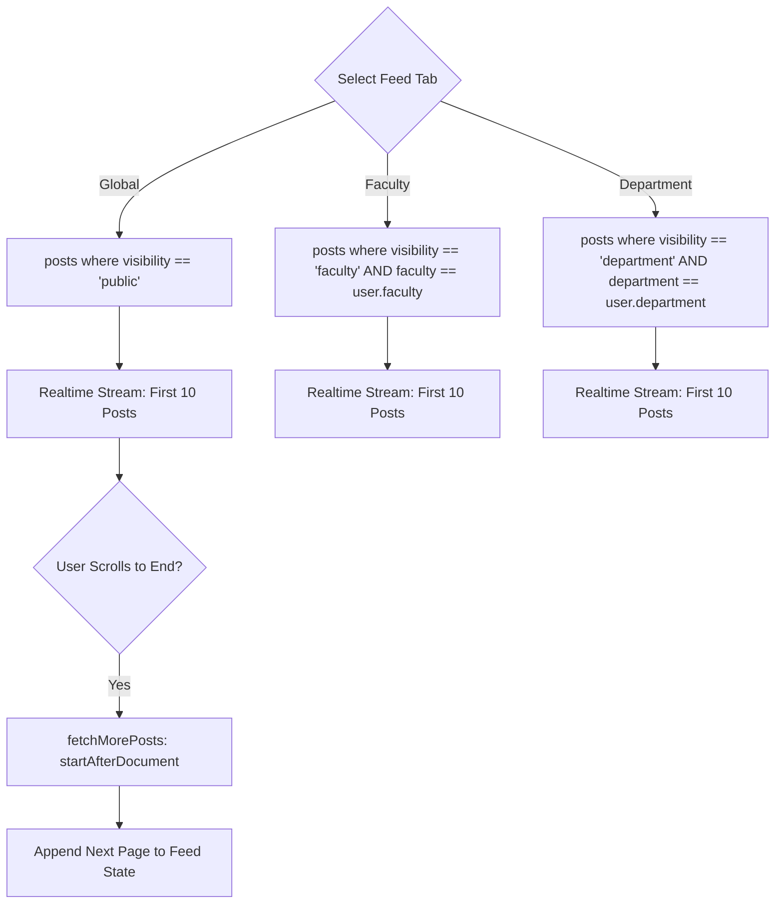
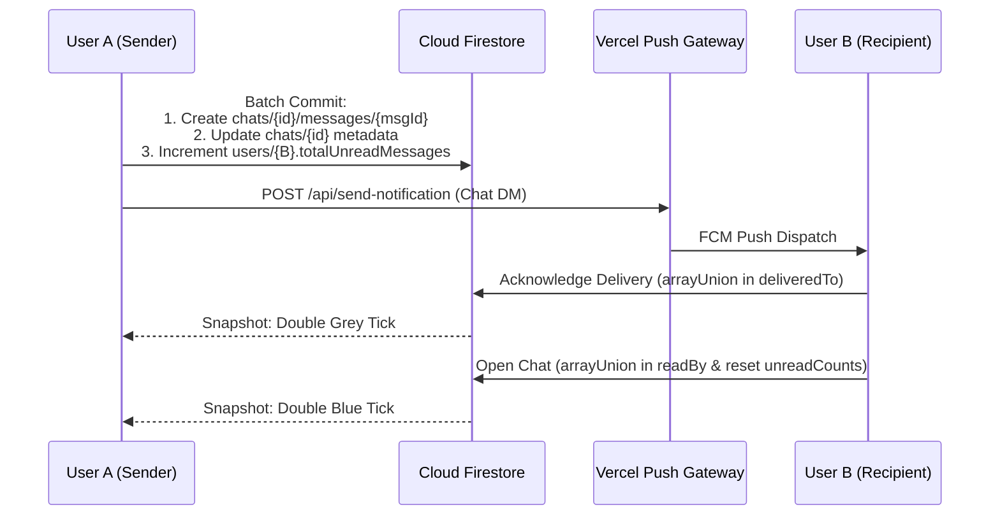
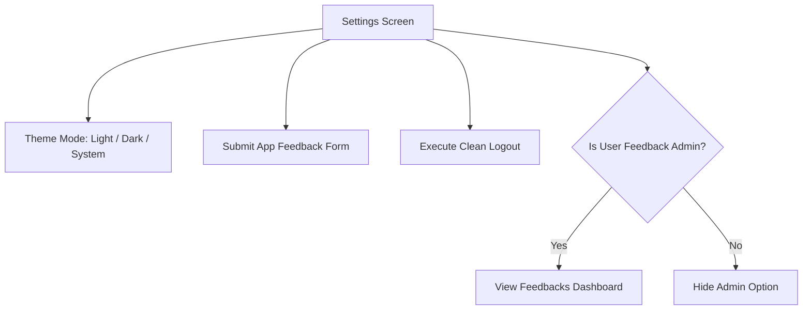

# RUN Campus Connect — Feature Specifications & Business Logic

This document provides exhaustive, in-depth technical specifications for every user-facing and background feature in the **RUN Campus Connect** platform, detailing screen routes, user flows, business logic, edge cases, and data persistence contracts.

---

## 1. Authentication & Onboarding Module

The authentication system governs identity verification, institutional domain enforcement, and two completely distinct onboarding pathways: returning staff/students and prospective freshmen.

```mermaid
stateDiagram-v2
    [*] --> LoginScreen: Launch Application
    LoginScreen --> GoogleOAuth: Tap "Sign in with Google"
    LoginScreen --> EmailLogin: Enter @run.edu.ng Credentials
    LoginScreen --> FresherSignUp: Tap "Fresher Sign Up"
    LoginScreen --> FresherSignIn: Tap "Fresher Sign In"

    GoogleOAuth --> DomainCheck: Hosted Domain Callback
    DomainCheck -->|Domain != @run.edu.ng| RejectAuth: Sign Out & Throw AuthFailure
    DomainCheck -->|Domain == @run.edu.ng| ProfileCheck

    EmailLogin --> EmailDomainCheck: Validate Email Format
    EmailDomainCheck -->|Not @run.edu.ng| RejectAuth
    EmailDomainCheck -->|Valid| FirebaseEmailAuth: signInWithEmailAndPassword()
    FirebaseEmailAuth --> ProfileCheck

    ProfileCheck -->|users/{uid} Missing or No displayName| CreateProfileScreen
    CreateProfileScreen --> EmailVerificationCheck
    ProfileCheck -->|Profile Exists| EmailVerificationCheck

    EmailVerificationCheck -->|Standard User & emailVerified == false| VerifyEmailScreen
    VerifyEmailScreen -->|User clicks link & taps Verify| HomeScreen
    EmailVerificationCheck -->|emailVerified == true| HomeScreen

    FresherSignUp --> UploadDocs: Cloudinary Upload (Slip + Admission)
    UploadDocs --> SyntheticEmailGen: Create {jamb}@fresher.run.edu.ng
    SyntheticEmailGen --> CallPythonOCR: POST /verify to FastAPI
    CallPythonOCR --> PendingVerificationScreen: isVerified = false
    FresherSignIn --> PendingVerificationCheck{Firestore isVerified?}
    PendingVerificationCheck -->|false| PendingVerificationScreen
    PendingVerificationCheck -->|true| HomeScreen
```

### 1.1 Returning Students & Staff (`@run.edu.ng`)
- **Supported Methods**:
  1. **Google Sign-In**: Restricted strictly to `@run.edu.ng` accounts via `hostedDomain: 'run.edu.ng'`. If a user bypasses this with a personal Gmail account, `AuthRepository.signInWithGoogle()` immediately revokes both Google and Firebase sessions and raises an `AuthFailure('Only RUN emails allowed.')`.
  2. **Email & Password**: Requires a valid institutional email ending in `@run.edu.ng`. Registration triggers an automated Firebase email verification link via `user.sendEmailVerification()`.
- **Email Verification Enforcement (`VerifyEmailScreen`)**:
  - Regular students logging in with unconfirmed emails cannot access social feeds or messaging.
  - Tapping **I Have Verified** reloads the user token via `user.reload()`. If `emailVerified` is still false, it displays an error banner; once confirmed, the router immediately clears the gate and navigates to `/home`.
  - A 30-second cooldown timer prevents abuse of the **Resend Email** button.

### 1.2 Fresher Onboarding & OCR Verification
Prospective students who have not yet received official `@run.edu.ng` Google Workspace accounts register through a dedicated JAMB verification flow.
- **Route**: `/fresher-signup` (`FresherSignUpScreen`) and `/fresher-signin` (`FresherSignInScreen`).
- **Input Fields**: Full legal name, JAMB registration number (normalized to uppercase), academic department, account password, JAMB result slip photo, and Redeemer's University admission letter photo.
- **Synthetic Email Generation**:
  - The system synthesizes an email address: `{jambNumber.toLowerCase()}@fresher.run.edu.ng`.
  - Derives `lastName` from the full name string (e.g. `"John Ade Okafor"` → `lastName: "Okafor"`) to support uppercase prefix searching.
- **Document Ingestion & Verification**:
  1. Both documents are uploaded to Cloudinary via `CloudinaryService.uploadPostImage()`.
  2. The client fires an asynchronous HTTP POST payload to `ApiConfig.verifyEndpoint` (`http://127.0.0.1:8000/verify`).
  3. The Python backend runs **EasyOCR** against both documents.
  4. The OCR engine confirms two criteria:
     - The normalized JAMB registration number appears in the extracted text.
     - University keywords appear (e.g. `"redeemer's university"`, `"redeemers university"`, `"run"`).
  5. Upon a match, the microservice directly updates Firestore `users/{uid}.isVerified = true` and purges the raw document images from Cloudinary storage.
  6. If OCR fails or the service is temporarily unreachable, the sign-up still succeeds safely: the user is placed on `/pending-verification` where an administrator can manually verify their documents or re-trigger verification.
- **Access Gate (`PendingVerificationScreen`)**:
  - Freshers with `isVerified: false` are restricted to this holding screen.
  - Back navigation into the main application is blocked by `resolveAuthRedirect`.
  - Tapping **Check Status** queries Firestore: if `isVerified` has switched to `true`, the user immediately transitions to `/home`.

### 1.3 Profile Completion (`CreateProfileScreen`)
Any authenticated user lacking a complete profile in `users/{uid}` (specifically where `displayName` is empty) is redirected here:
- Captures: Display Name, Faculty (dropdown from `RunUniversityData`), Department (filtered cascading dropdown), Academic Level (100–500, Post-Graduate), Optional Bio, Optional Profile Photo (Cloudinary upload), and Birthday (Day + Month picker).

---

## 2. Home & Social Feed Module

**Route**: `/home` (Shell Tab Index 0)

The home feed serves as the central campus square, divided into three distinct visibility scopes with real-time updates and infinite scroll pagination.



### 2.1 Multi-Tab Scoping
1. **Global Feed**:
   - Query: `posts.where('visibility', isEqualTo: 'public').orderBy('timestamp', descending: true)`.
   - Accessible to all verified students and staff across the entire university.
2. **Faculty Feed**:
   - Query: `posts.where('visibility', isEqualTo: 'faculty').where('faculty', isEqualTo: user.faculty).orderBy('timestamp', descending: true)`.
   - Contains posts relevant only to peers within the author's faculty (e.g. Faculty of Engineering).
3. **Department Feed**:
   - Query: `posts.where('visibility', isEqualTo: 'department').where('department', isEqualTo: user.department).orderBy('timestamp', descending: true)`.
   - Granular discussions restricted to classmates in the same department (e.g. Computer Science).

### 2.2 Post Creation & Media Attachment (`CreatePostScreen`)
- **Route**: `/create-post`
- **Validation**: Requires non-empty text content or an attached image. Requires a completed user profile.
- **Denormalized Author Snapshot**:
  ```json
  {
    "uid": "user_123",
    "name": "Jane Doe",
    "dept": "Computer Science",
    "photo": "https://res.cloudinary.com/..."
  }
  ```
  - Embedding `authorSnapshot` directly on the post document eliminates expensive N+1 profile queries when rendering feed lists.
- **Media Ingestion**:
  - Images selected from gallery or camera are uploaded to Cloudinary via `CloudinaryService`.
  - The resulting `imageUrl`, `imagePublicId`, and `imageDeleteToken` are stored on the post document for future cascade deletion.
- **Fan-Out Notification Creation**:
  - Automatically queries eligible target users (all university users for global posts, faculty peers for faculty posts, department peers for department posts).
  - Generates individual documents in the `notifications` collection in batches of up to 450 writes.
  - Dispatches an FCM topic push alert via Vercel to `global`, `faculty_{slug}`, or `department_{slug}`.

### 2.3 Post Interactions & Engagement
- **Real-Time Likes (`LikeService`)**:
  - Stored in a subcollection: `posts/{postId}/likes/{userId}`.
  - Toggling a like executes a Firestore atomic transaction:
    - If like document exists → deletes the doc and decrements `posts/{postId}.likeCount` by 1.
    - If like document does not exist → creates doc with `timestamp` and increments `likeCount` by 1.
  - `firestore.rules` enforces that `likeCount` can only be incremented or decremented by exactly 1 (`isValidCounterDelta('likeCount', -1, 1)`).
- **Threaded Comments (`CommentRepository`)**:
  - Route: `/post/:postId/comments` (`PostDetailsScreen`).
  - Stored in `posts/{postId}/comments/{commentId}` ordered chronologically (`timestamp asc`).
  - Adding a comment atomically increments `posts/{postId}.commentCount` by 1.
- **Unique View Tracking (`incrementViewCount`)**:
  - Stored in `posts/{postId}/views/{viewerUid}`.
  - The author of a post is excluded from view tracking.
  - Uses an atomic transaction: if `views/{viewerUid}` already exists, the transaction no-ops. If new, sets the view document and increments `posts/{postId}.viewCount` by 1.
- **Post Deletion (`deletePost`)**:
  - Guarded strictly to the original post author (`authorSnapshot.uid == auth.currentUser.uid`).
  - Executes a cascade cleanup:
    1. Purges the image from Cloudinary using `deleteToken` or Vercel `delete-cloudinary-asset` via `imagePublicId`.
    2. Batch-deletes all subcollections (`likes`, `views`, `comments`) in chunks of 450 documents.
    3. Deletes the primary post document.

### 2.4 Birthday Recognition Banner
- When the current date matches `user.birthDay` and `user.birthMonth`, `BirthdayService` triggers:
  1. Displays an celebratory birthday banner across the top of the Home feed.
  2. Dispatches an automated direct message from the system bot (`campus_connect_bot`).
  3. Prevents duplicate greetings on the same calendar day by setting a flag at `users/{uid}/birthday_flags/{YYYY-MM-DD}`.

---

## 3. Explore & Institutional Content Module

**Route**: `/explore` (Shell Tab Index 1)

The Explore hub provides official university resources, administrative documentation, news bulletins, and global student directory search.

### 3.1 RUN News Carousel & Detail View
- Displays a horizontal carousel of official university news articles populated from `run_news` Firestore collection (scraped from `run.edu.ng/news/`).
- Tapping an item opens `/news-detail` (`NewsDetailScreen`), displaying the high-resolution image, headline, publication date, full article body text, and tap-to-expand image viewer.

### 3.2 Institutional Content Sub-Screens
All pages render structured institutional content scraped from official university portals:

| Screen | Route | Data Source | Key Information Displayed |
| :--- | :--- | :--- | :--- |
| **Our History** | `/history` | `run_our_history/our_history` | Founding of Redeemer's University (2005), RCCG visionary roots, transition from Redemption Camp to Ede campus. |
| **Governance** | `/governance` | `run_governance/governance` + bundled HTML asset fallback | Chancellor, Vice-Chancellor, Board of Trustees, Governing Council, and University Senate leadership directories. |
| **Vision & Mission** | `/vision-mission` | `run_vision_mission/vision_mission` | Institutional vision statement, mission objectives, and 10-year strategic growth frameworks. |
| **Motto, Logo & Anthem** | `/motto-logo-anthem` | `run_motto_logo_anthem/motto_logo_anthem` | "Running with a Vision", official university crest symbolism, blue/gold color semantics, and university anthem lyrics. |
| **Contacts Directory** | `/contacts` | Static embedded constants | Registry, Admissions, Student Affairs, ICT Helpdesk, and Bursary telephone numbers and email addresses. |

### 3.3 Governance Remote/Local Fallback Strategy
`GovernanceScreen` leverages `GovernanceHtmlRepository`. When opened:
1. Immediately renders the offline bundled HTML asset (`assets/webpages/Governance.html`) in a mobile `WebView`.
2. Simultaneously attempts a background fetch to `https://run.edu.ng/governance/`.
3. If the network fetch succeeds, the WebView seamlessly updates with the live web markup without flickering.

### 3.4 Student Directory Search (`ExploreController`)
- Allows users to search for peers by name.
- Queries Firestore using dual uppercase prefix queries:
  - Query 1: `users.where('displayName', isGreaterThanOrEqualTo: Q).where('displayName', isLessThanOrEqualTo: Q + '\uf8ff')`
  - Query 2: `users.where('lastName', isGreaterThanOrEqualTo: Q).where('lastName', isLessThanOrEqualTo: Q + '\uf8ff')`
- Merges results, eliminates duplicates, filters out the current user, and caps results at 20 profiles.
- Tapping a result opens `/user/:userId` (`UserProfileScreen`).

---

## 4. Direct Messaging & Real-Time Chat Module

**Routes**: `/messages` (`InboxScreen`) and `/chat/:userId` (`ChatScreen`)

The chat system delivers one-on-one private messaging with real-time streaming, quote replies, keyword search, delivery synchronization, and read receipts.



### 4.1 Deterministic Channel IDs (`getChatId`)
1-on-1 conversations do not create random chat identifiers. Chat IDs are computed deterministically by sorting participant UIDs alphabetically:
```dart
String getChatId(String uid1, String uid2) {
  return uid1.compareTo(uid2) < 0 ? '${uid1}_$uid2' : '${uid2}_$uid1';
}
```
This guarantees that regardless of which user initiates the conversation, both users always map to the exact same Firestore document (`chats/{uid1_uid2}`).

### 4.2 Messaging Lifecycle & Tick Indicators
Each message document in `chats/{chatId}/messages/{messageId}` contains two tracking arrays:
- `deliveredTo`: List of UIDs whose devices have received the message.
- `readBy`: List of UIDs who have actively opened and viewed the message.

Visual UI Tick Mapping on `ChatScreen`:
- **Single Grey Tick**: Message written to Firestore (`deliveredTo` contains only sender).
- **Double Grey Tick**: Message received on recipient's device (`deliveredTo` contains recipient).
- **Double Blue Tick**: Recipient has opened the chat (`readBy` contains recipient).

### 4.3 Message Quoting & Replies
Users can swipe right or long-press on any message to trigger a reply preview banner above the text input. The sent message embeds a `replyTo` map containing `{ messageId, content, senderName }`, rendered as a quote block inside the chat bubble.

### 4.4 In-Chat Search (`ChatSearchController`)
The chat screen features an expandable search bar that filters the loaded message list in memory, highlighting matching keywords and scrolling directly to target messages.

### 4.5 User Presence & Last Seen (`PresenceService`)
- While the app is active, `PresenceService` writes `isOnline: true` and starts a 60-second periodic heartbeat updating `users/{uid}.lastSeenAt`.
- When the app is backgrounded or killed, it immediately writes `isOnline: false` with a final `lastSeenAt` timestamp.
- The chat header displays:
  - `"Online"` (if `isOnline == true` and `lastSeenAt` is within the last 120 seconds).
  - `"Last seen [time/date]"` (if offline).

### 4.6 Unread Badge Counter Math
- When User A sends a message to User B:
  - `chats/{chatId}.unreadCounts[UserB]` is incremented by 1.
  - `users/{UserB}.totalUnreadMessages` is incremented by 1 using `FieldValue.increment(1)`.
- When User B opens the chat:
  - Reads `unreadCounts[UserB]` (e.g. 5 unread messages).
  - Resets `chats/{chatId}.unreadCounts[UserB] = 0`.
  - Atomically decrements `users/{UserB}.totalUnreadMessages` by exactly 5 (`FieldValue.increment(-5)`).
  - The bottom navigation bar unread badge stream (`unreadBadgeProvider`) updates instantly.

---

## 5. Notification System Module

**Route**: `/notifications` (Shell Tab Index 2)

The notification system coordinates in-app notifications with remote background push delivery.

### 5.1 In-App Notification Center
- Notifications are stored in the top-level collection: `notifications/{notificationId}`.
- Categorized into three tabs:
  1. **All**: All alerts addressed to `recipientId == currentUser.uid`.
  2. **Faculty**: Alerts generated by posts scoped to the user's faculty.
  3. **Department**: Alerts generated by posts scoped to the user's department.
- Tapping a notification marks `isRead: true` and navigates to the associated post or chat thread.

### 5.2 FCM Remote Push Delivery
- Managed via `FcmService` and the Vercel serverless gateway (`/api/send-notification`).
- **Topic Subscriptions**:
  Upon login and profile completion, the client subscribes to three FCM topics:
  1. `global`
  2. `faculty_{slug}` (e.g. `faculty_engineering`)
  3. `department_{slug}` (e.g. `department_computer_engineering`)
- **Direct Message Push**:
  - When User A messages User B, `NotificationService` calls Vercel.
  - Vercel checks `users/{recipient}/settings/notifications` to ensure User A is not in User B's `mutedUsers` list.
  - If unmuted, dispatches the push alert directly to User B's FCM registration token.
- **Foreground Alert Handling**:
  - When the app is in the foreground and the user is actively viewing a screen (`AppLifecycleState.resumed`), system heads-up notifications are suppressed to prevent visual annoyance, as in-app badges and streams already reflect the updates.
  - If the app is in any non-resumed state, `flutter_local_notifications` displays a heads-up banner with sound and vibration.

---

## 6. User Profile Module

**Route**: `/profile` (Shell Tab Index 3) and `/user/:userId` (`UserProfileScreen`)

### 6.1 Profile Fields & Academic Metadata
The `UserProfile` model maintains complete academic and personal identity attributes:
- `uid`, `email`, `displayName`, `lastName`, `faculty`, `department`, `level`, `bio`, `photoUrl`.
- `birthDay` (1–31) and `birthMonth` (1–12).
- `formattedBirthday`: Returns human-readable strings with correct English ordinal suffixes (e.g., `"January 1st"`, `"March 2nd"`, `"April 3rd"`, `"October 15th"`).

### 6.2 Profile Actions & Timeline
- **Edit Profile (`/profile/edit`)**: Allows editing bio, level, avatar image, and birthday. Faculty and department updates automatically trigger `FcmService.updateTopicSubscriptions()` to unsubscribe from old topics and subscribe to new ones.
- **Own Posts Feed (`UserPostsList`)**: Displays a chronological list of all posts created by the user, with quick delete actions for post management.
- **About Modal (`AboutBottomSheet`)**: Displays app version, build number, copyright information, and links to institutional websites.

---

## 7. Settings, Preferences & Admin Triage Module

**Route**: `/settings` (`SettingsScreen`)



### 7.1 Brand Theming (Material 3)
- Supported modes: **Light Mode**, **Dark Mode**, and **System Default**, managed by `ThemeModeController` and persisted locally in `SharedPreferences`.
- **Palette**:
  - **RUN Navy Blue** (`#003366`): Primary brand color, AppBar background, button accents.
  - **RUN Gold** (`#FFCC00`): Secondary brand color, FloatingActionButton foreground, tab selection indicator, cursor and caret color in dark mode.
  - **Executive Navy** (`#050A30`): Dark mode scaffold background.
  - **Executive Card** (`#1E272E`): Dark mode card surface.
- Typography: Uses **Google Fonts (Poppins)** with offline fallback to system fonts via `--dart-define=USE_SYSTEM_FONTS=true`.

### 7.2 Secure Clean Logout Sequence
To prevent cross-user data leakage and ensure Firestore writes succeed, `SettingsController.performCleanLogout()` executes an orchestrated 4-step sequence:
1. **Pre-Signout Profile Fetch**: Reads the user profile while the Firebase Auth session is still valid.
2. **Local Image Cache Purge**: Clears `PaintingBinding.instance.imageCache` and live images so previous user avatars do not persist in memory.
3. **Authenticated Cleanup**:
   - Stops `PresenceService` and writes `isOnline: false` to Firestore.
   - Deletes the FCM token from `users/{uid}` and unsubscribes from FCM topics.
4. **Auth Revocation & Provider Invalidation**:
   - Calls `FirebaseAuth.signOut()` and `GoogleSignIn.signOut()`.
   - Invalidates all user-scoped Riverpod providers (`currentUserProfileProvider`, `authStateChangesProvider`, `chatDeliverySyncProvider`).
   - The GoRouter redirect engine automatically transitions the user to `/`.

### 7.3 User Feedback Submission (`FeedbackFormScreen`)
- **Route**: `/settings/feedback`
- **Fields**: User selects Category (Bug, Feature Request, UI/UX, General), Rating (1 to 5 stars), and enters a detailed Message.
- **Automated Background Telemetry**:
  - Automatically captures `userId`, `userName`, `appVersion` (via `package_info_plus`), `deviceInfo` (via `device_info_plus`), `timestamp` (`FieldValue.serverTimestamp()`), and sets `status: 'pending'`.
  - Dispatches an instant push notification directly to the administrator's device via Vercel without writing a public notification document.

### 7.4 Admin Feedback Triage (`AdminFeedbackListScreen`)
- **Route**: `/settings/feedbacks`
- **Authorization Gate**:
  - Only accessible if `user.email == 'ale-alaba12850@run.edu.ng'` or `user.uid == 'sic5nS2lR6QBiMljDOW1ZVWwESF3'`.
  - Firestore security rules strictly block non-admin reads on the `feedback` collection.
- **Workflow**:
  - Displays list of all submitted feedback reports sorted by timestamp.
  - Allows the administrator to update feedback status: `pending` → `reviewed` → `resolved`.

---

## 8. Dual Application Update Module

**Route**: `/update-center` (`UpdateCenterPage`)

The update architecture safeguards platform availability through two update tiers:

### 8.1 Shorebird Code Push (Minor / Dart Hotfixes)
- Integrated via `shorebird_code_push`.
- Checks for patches silently on application launch.
- Downloads patches in background isolates; patches activate on next app start without user disruption.

### 8.2 Binary Delta Patching & Full APK Engine
- Activated when native Android code or Flutter engine versions change.
- Evaluated via Firebase Remote Config parameters:
  - `min_version`: Minimum supported app version (e.g. `1.0.0`).
  - `rollout_percentage`: Phased deployment bucket (0–100%).
  - `patch_url` & `patch_sha256`: Delta patch package for users 1 version behind.
  - `update_url` & `update_sha256`: Full APK package for users 2+ versions behind.
- **Deterministic Rollout Bucketing**:
  ```dart
  final hash = md5.convert(utf8.encode(userUid)).bytes;
  final bucket = ((hash[0] << 24) | (hash[1] << 16) | (hash[2] << 8) | hash[3]).abs() % 100;
  return bucket < rolloutPercentage;
  ```
  Guarantees that a given user always falls into the exact same rollout bucket regardless of app restarts.

### 8.3 Download Engine & User Interface
- **Floating Overlay (`FlexibleUpdateOverlay`)**: Non-blocking floating bar showing download percentage and speed; allows users to continue browsing while downloading.
- **Modal Barrier (`UpdateRequiredDialog`)**: Blocking modal dialog shown when the installed version is strictly less than `min_version`.
- **Full Update Center (`UpdateCenterPage`)**: Dedicated screen displaying current vs new version numbers, release notes, progress bars, pause/resume controls, and an **Install Now** button.
- **Delta Synthesis**: Uses JNI `libhpatchz.so` to reconstruct the full APK from the installed base APK and the delta patch, saving up to 90% of user cellular data.
