# RUN Campus Connect — Technical Documentation Portal

Welcome to the definitive documentation portal for **RUN Campus Connect**, the official campus social, communication, and verified onboarding platform designed specifically for **Redeemer's University (RUN)**.

---

## 1. System Overview

RUN Campus Connect bridges communication between students, faculty members, university staff, and prospective students (freshers). The platform provides a rich social feed scoped to institutional boundaries, private direct messaging with instant delivery indicators and read receipts, centralized access to official university content, automated freshman verification via computer vision and optical character recognition (OCR), real-time alerts, and seamless zero-downtime application updates.

### Core System Attributes

| Parameter | Specification |
| :--- | :--- |
| **Application ID / Package** | `com.run.campus_connect` / `run_campus_connect` |
| **Current Production Version** | `1.0.0+4` (Dart SDK `^3.7.2`, Flutter 3.7+) |
| **Firebase Project** | `run-campus-connect` |
| **Primary Domain White-list** | Staff & Students: `@run.edu.ng` · Freshers: `@fresher.run.edu.ng` |
| **State Management** | Flutter Riverpod 2.x with code generation (`riverpod_annotation`, `build_runner`) |
| **Declarative Router** | `go_router` 14.x with auth-aware redirect state machine |
| **Push Gateway** | Vercel Serverless (Node.js 18+ runtime, Firebase Admin SDK) |
| **Document Verification** | Python FastAPI microservice with EasyOCR (PyTorch CPU/GPU inference) |
| **Media Delivery Network** | Cloudinary CDN with signed / unsigned secure upload presets |
| **Update Distribution** | Shorebird Code Push (OTA Dart runtime) + Custom Binary Delta Engine (`libhpatchz.so` via JNI) |

---

## 2. System Architecture Topology

The application operates across four distinct tiers: the cross-platform client, the Firebase backend-as-a-service cloud layer, specialized serverless/microservice compute nodes, and content delivery networks.

```mermaid
flowchart TB
    subgraph ClientTier ["Client Tier (Flutter Cross-Platform)"]
        UI["Flutter Application (Android, iOS, Web, Windows)"]
        LocalCache["Hive Local Caches (feed_cache, download_engine)"]
        NativeJNI["Native JNI Bridge (libhpatchz.so, MethodChannel)"]
        UI <--> LocalCache
        UI <--> NativeJNI
    end

    subgraph FirebaseTier ["Firebase Cloud Infrastructure (run-campus-connect)"]
        Auth["Firebase Authentication (Google OAuth + Email/Password)"]
        Firestore["Cloud Firestore (Real-time NoSQL Database)"]
        FCM["Firebase Cloud Messaging (FCM Push Service)"]
        RemoteConfig["Firebase Remote Config (Update Gates & Rollouts)"]
        Analytics["Firebase Analytics & Performance Monitoring"]
    end

    subgraph ComputeTier ["External Compute & Microservices"]
        FastAPI["Python FastAPI OCR Service (EasyOCR Engine)"]
        VercelGateway["Vercel Serverless Gateway (/api/send-notification, /api/delete-asset)"]
    end

    subgraph MediaTier ["Media & Distribution CDNs"]
        Cloudinary["Cloudinary CDN (User Posts, Avatars, Document Ingestion)"]
        Shorebird["Shorebird Cloud (OTA Code Push Patches)"]
    end

    UI -->|"Authenticate (@run.edu.ng)"| Auth
    UI -->|"Real-time sync (Posts, Chats, Notifications)"| Firestore
    UI -->|"FCM Token registration & Foreground alerts"| FCM
    UI -->|"Fetch update rules & rollout flags"| RemoteConfig
    UI -->|"Telemetry & Performance traces"| Analytics
    UI -->|"Upload post images & verification documents"| Cloudinary
    UI -->|"Submit fresher verification payload"| FastAPI
    UI -->|"Trigger authenticated push alerts"| VercelGateway
    UI -->|"Pull runtime Dart patches"| Shorebird

    VercelGateway -->|"Admin SDK token send & topic broadcasts"| FCM
    VercelGateway -->|"Read user mute list & write deliveredTo"| Firestore
    FastAPI -->|"Verify JAMB & update isVerified=true"| Firestore
    FastAPI -->|"Purge verification documents"| Cloudinary
```



---

## 3. Master Documentation Directory

This documentation suite provides a complete, exhaustive breakdown of every subsystem, file, data model, API contract, test suite, and operational procedure within the RUN Campus Connect repository.

```
docs/
├── README.md                      # [You are here] Documentation Portal & System Map
├── ARCHITECTURE.md                # System Architecture, Patterns & Data Flows
├── GETTING_STARTED.md             # Developer Onboarding & Environment Setup
├── FEATURES.md                    # In-Depth Feature Modules & Business Rules
├── DATABASE_SCHEMA.md             # Firestore Collections, Models, ERDs & Caching
├── SECURITY_AND_RULES.md          # Firestore & Storage Rules, Auth Perimeter & Privacy
├── API_REFERENCE.md               # Python FastAPI, Vercel Serverless & Native Channels
├── DEVELOPMENT_GUIDE.md           # Engineering Conventions, Riverpod, Code Gen & Builds
├── TESTING_AND_QA.md              # 109 Test Cases Matrix, Unit/Widget, E2E & UAT
├── SCRAPERS_AND_MAINTENANCE.md    # Institutional Scrapers, ETL & Admin Utilities
├── CODEBASE_INVENTORY.md          # Exhaustive File-by-File Catalog of Every Project File
└── uat_test_accounts.json         # Pre-configured UAT Test Account Credentials
```

### Document Directory Guide

| Document | Focus & Highlights | Intended Audience |
| :--- | :--- | :--- |
| **[Architecture](./ARCHITECTURE.md)** | Multi-tier topology, Clean Architecture layers (`data`, `domain`, `presentation`), Riverpod dependency graph, GoRouter auth state machine, WhatsApp-style real-time delivery synchronization, binary delta update engine. | System Architects, Tech Leads, Core Developers |
| **[Getting Started](./GETTING_STARTED.md)** | Step-by-step setup for Flutter, Android SDK, Firebase CLI, Python FastAPI backend, Vercel CLI, Cloudinary credentials, ADB reverse networking, and initial build execution. | New Engineers, Contributors, DevOps |
| **[Features](./FEATURES.md)** | Comprehensive specifications for Authentication, Tri-scoped Social Feed, Explore & Institutional Content, 1-on-1 Chat, Notification System, User Profiles, Settings & Admin Feedback Triage, and Dual Update Engine. | Product Managers, QA Engineers, Full-Stack Devs |
| **[Database Schema](./DATABASE_SCHEMA.md)** | Complete Firestore collection and subcollection specifications, field schemas, data types, indexing rules, denormalization trade-offs, Storage bucket rules, and Hive/SharedPreferences local storage schemas. | Backend Developers, Database Administrators |
| **[Security & Rules](./SECURITY_AND_RULES.md)** | Line-by-line audit of `firestore.rules` and `storage.rules`, role-based access control, counter delta protection, chat participant repair logic, authentication perimeter, and data privacy safeguards. | Security Auditors, DevOps, Core Maintainers |
| **[API Reference](./API_REFERENCE.md)** | Complete specification of Python FastAPI OCR endpoints (`/verify`), Vercel Serverless notification/cleanup endpoints (`/api/send-notification`, `/api/delete-cloudinary-asset`), and native Android MethodChannels. | API Consumers, Backend Engineers, Integration Testers |
| **[Development Guide](./DEVELOPMENT_GUIDE.md)** | Coding conventions, Riverpod code generation workflows, error handling with `AsyncValue.guard`, theming tokens, release versioning, Shorebird release commands, and APK packaging. | Flutter Developers, Mobile Engineers |
| **[Testing & QA](./TESTING_AND_QA.md)** | 109-test-case testing matrix (Unit, Integration, System, UAT), test execution commands, mock generation, UAT account seeding, and automated emulator script (`tools/run_uat_emulator.ps1`). | QA Engineers, Test Automation Engineers, CI/CD Maintainers |
| **[Scrapers & Maintenance](./SCRAPERS_AND_MAINTENANCE.md)** | Playwright and BeautifulSoup web scrapers for RUN news, governance, history, and anthem; database migration, user name normalization, feedback extraction, and UAT Remote Config scripts. | Data Engineers, Maintenance Developers, System Admins |
| **[Codebase Inventory](./CODEBASE_INVENTORY.md)** | Meticulous catalog of every single source file in `lib/`, `python_backend/`, `vercel_functions/`, `tools/`, and root directories with role, key symbols, and dependencies. | Code Reviewers, Auditors, Anyone exploring codebase |

---

## 4. Role-Based Reading Paths

Depending on your role and task, follow the recommended reading sequences below:

### Path A: Mobile Application Engineers
1. **[Getting Started](./GETTING_STARTED.md)**: Set up your Flutter environment and compile the application.
2. **[Architecture](./ARCHITECTURE.md)**: Understand the feature-first pattern, Riverpod code generation, and routing.
3. **[Features](./FEATURES.md)**: Deep dive into the user-facing features and state controllers.
4. **[Development Guide](./DEVELOPMENT_GUIDE.md)**: Learn daily coding standards, styling conventions, and build workflows.

### Path B: Backend & Integration Engineers
1. **[API Reference](./API_REFERENCE.md)**: Review Python FastAPI and Vercel Serverless gateway specifications.
2. **[Database Schema](./DATABASE_SCHEMA.md)**: Master the Firestore collections, subcollections, and indexes.
3. **[Security & Rules](./SECURITY_AND_RULES.md)**: Understand access control, token verification, and data validation rules.
4. **[Scrapers & Maintenance](./SCRAPERS_AND_MAINTENANCE.md)**: Maintain background synchronization jobs and database scripts.

### Path C: QA & Test Engineers
1. **[Testing & QA](./TESTING_AND_QA.md)**: Review the 109-case testing matrix and traceability records.
2. **[Getting Started](./GETTING_STARTED.md)**: Configure local emulators and ADB reverse port routing.
3. **[Features](./FEATURES.md)**: Verify functional acceptance criteria against feature business rules.
4. **[uat_test_accounts.json](./uat_test_accounts.json)**: Utilize provisioned test personas for end-to-end testing.

### Path D: System Architects & Security Reviewers
1. **[Architecture](./ARCHITECTURE.md)**: Comprehensive system overview, tier topology, and synchronisation models.
2. **[Security & Rules](./SECURITY_AND_RULES.md)**: Exhaustive security audit of Firestore rules and serverless authorization.
3. **[Database Schema](./DATABASE_SCHEMA.md)**: Data modeling, atomic transactions, and denormalization choices.
4. **[Codebase Inventory](./CODEBASE_INVENTORY.md)**: Complete structural breakdown of the codebase.

---

## 5. Quick Development Cheat-Sheet

Common terminal commands executed during daily development on RUN Campus Connect:

```bash
# ── Flutter Mobile Development ──────────────────────────────────────────────
# Fetch Dart and Flutter package dependencies
flutter pub get

# Run Riverpod code generator (watches and regenerates *.g.dart files)
dart run build_runner build --delete-conflicting-outputs

# Execute all automated unit and widget tests
flutter test

# Run code analysis across lib/ and test/
flutter analyze

# Forward TCP port 8000 to connected Android device for local OCR verification
adb reverse tcp:8000 tcp:8000

# Launch application on connected device or emulator
flutter run

# ── Python Verification Backend ─────────────────────────────────────────────
# Activate virtual environment (Windows PowerShell)
.\python_backend\venv\Scripts\Activate.ps1

# Run FastAPI verification server locally on port 8000
uvicorn main:app --reload --host 0.0.0.0 --port 8000

# Seed UAT test accounts into Firebase project
python python_backend/scripts/seed_uat_accounts.py

# ── Vercel Serverless Functions ─────────────────────────────────────────────
# Test Vercel function endpoints locally
cd vercel_functions && npx vercel dev

# Deploy serverless functions to production
cd vercel_functions && npx vercel --prod

# ── Shorebird OTA Code Push ──────────────────────────────────────────────────
# Build and publish a new OTA code patch to active users
shorebird patch android
```

---

> [!TIP]
> For questions regarding specific screens, widgets, or controllers, refer to the **[Codebase Inventory](./CODEBASE_INVENTORY.md)** for a file-by-file index of the entire repository.
