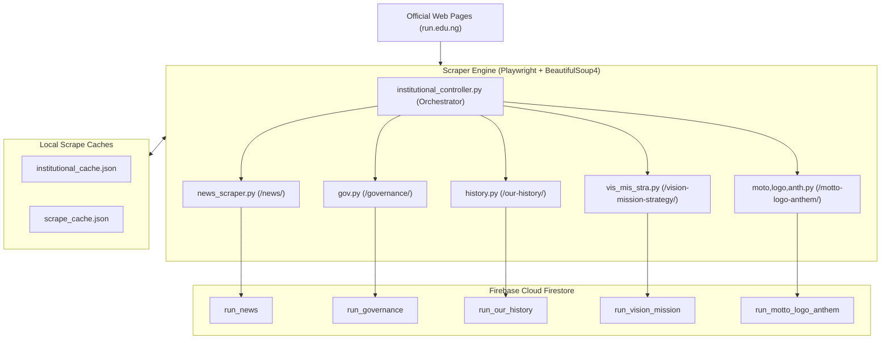

# RUN Campus Connect — Scrapers, ETL & Database Maintenance

This document provides a comprehensive operational guide for the web scraping pipeline, data extraction workflows, and database maintenance scripts located in `python_backend/scripts/`.

---

## 1. Architectural Overview of the Scraper Suite

The Explore hub within the mobile application delivers official institutional data directly to students. To maintain fresh content without requiring manual data entry, the platform uses an automated extraction, transformation, and loading (ETL) pipeline targeting official Redeemer's University web portals.



---

## 2. Environment Setup & Prerequisites

Scraper dependencies are defined in `python_backend/scripts/requirements-scraper.txt`:

```bash
cd python_backend

# Activate virtual environment
.\venv\Scripts\Activate.ps1

# Install scraping dependencies
pip install -r scripts/requirements-scraper.txt

# Install Playwright Chromium headless browser binaries
playwright install chromium
```

---

## 3. Institutional Scrapers Reference

### 3.1 News Scraper (`news_scraper.py`)
- **Target URL**: `https://run.edu.ng/news/`
- **Output Collection**: `run_news/{newsId}`
- **Execution**:
  ```bash
  # Run headless (all articles)
  python scripts/news_scraper.py

  # Run headful with visible browser window (debugging)
  python scripts/news_scraper.py --headful

  # Limit extraction to recent N articles
  python scripts/news_scraper.py --limit 10
  ```
- **Extraction Logic**:
  1. Uses Playwright Chromium to load the university news index.
  2. Extracts article links, title headings, thumbnail images, and publication dates.
  3. Navigates into each individual news article page to extract the full plain text body (`fullPost`).
  4. Generates deterministic document IDs using SHA-256 hashes of the article URL:
     ```python
     doc_id = hashlib.sha256(article_url.encode('utf-8')).hexdigest()[:20]
     ```
     *This ensures that re-running the scraper updates existing records without creating duplicates.*

---

### 3.2 Governance Scraper (`gov.py`)
- **Target URL**: `https://run.edu.ng/governance/`
- **Output Document**: `run_governance/governance`
- **Extracted Entities**:
  - **Principal Officers**: Vice-Chancellor, Deputy Vice-Chancellors, Registrar, Bursar, and University Librarian (captures name, title/role, portrait photo URL, and biography).
  - **Board of Trustees**: Names and designations.
  - **Governing Council**: Council members and external appointees.
  - **University Senate**: Provosts, Deans, and Heads of Departments.

---

### 3.3 History Scraper (`history.py`)
- **Target URL**: `https://run.edu.ng/our-history/`
- **Output Document**: `run_our_history/our_history`
- **Extracted Entities**:
  - Narrative history of Redeemer's University from its 2005 establishment at Redemption Camp to its permanent campus in Ede, Osun State.
  - Historical image gallery URLs.

---

### 3.4 Vision, Mission & Strategy Scraper (`vis_mis_stra.py`)
- **Target URL**: `https://run.edu.ng/vision-mission-strategy/`
- **Output Document**: `run_vision_mission/vision_mission`
- **Extracted Entities**:
  - Official Vision Statement.
  - Official Mission Statement.
  - 10-Year Strategic Plan Pillars.

---

### 3.5 Motto, Logo & Anthem Scraper (`moto,logo,anth.py`)
- **Target URL**: `https://run.edu.ng/motto-logo-anthem/`
- **Output Document**: `run_motto_logo_anthem/motto_logo_anthem`
- **Extracted Entities**:
  - University Motto: *"Running with a Vision"*.
  - Logo and Crest Heraldry Description.
  - Institutional Brand Colors (Royal Navy Blue and Gold).
  - Official Redeemer's University Anthem lyrics.

---

### 3.6 Scraper Orchestrator (`institutional_controller.py`)
To run all institutional scrapers in sequence with disk-level JSON caching:
```bash
python scripts/institutional_controller.py
```
- Writes intermediate outputs to `institutional_cache.json` and `scrape_cache.json`.
- Compares cached checksums before performing Firestore batch writes, minimizing unnecessary database write operations.

---

## 4. Database Maintenance & Admin Utilities

The repository provides several specialized administration scripts in `python_backend/scripts/`:

### 4.1 UAT Persona Provisioning (`seed_uat_accounts.py`)
- **Execution**: `python scripts/seed_uat_accounts.py`
- **Purpose**: Creates or resets the standard UAT personas in Firebase Authentication and Cloud Firestore (e.g. `uat.student.a@run.edu.ng`, `uat.student.b@run.edu.ng`, `12345678uat@fresher.run.edu.ng`).
- Emits credentials and UIDs into `docs/uat_test_accounts.json`.

### 4.2 Search Index Normalization (`normalize_user_names.py` & `backfill_last_name.py`)
- **Execution**:
  ```bash
  python scripts/normalize_user_names.py
  python scripts/backfill_last_name.py
  ```
- **Purpose**:
  - Firestore does not support native full-text search without external engines like Algolia.
  - `normalize_user_names.py` converts all existing `displayName` strings to uppercase.
  - `backfill_last_name.py` derives the surname from `displayName` and populates the `lastName` field.
  - This enables case-insensitive prefix searches across both first and last names in the student directory.

### 4.3 Feedback Data Export (`fetch_feedbacks.py`)
- **Execution**: `python scripts/fetch_feedbacks.py`
- **Purpose**: Queries the Firestore `feedback` collection and exports all submissions into `feedbacks.json` and `feedbacks.csv` for institutional reporting.

### 4.4 Test Database Teardown (`clear_firestore_and_auth.js`)
- **Execution**: `node scripts/clear_firestore_and_auth.js`
- **Purpose**: Node.js script using Firebase Admin SDK to purge test documents from collections and delete test accounts between major staging milestones.

### 4.5 Remote Config Testing Utility (`uat_remote_config.py`)
- **Execution**: `python scripts/uat_remote_config.py --min-version 99.0.0 --rollout 100`
- **Purpose**: Directly updates Firebase Remote Config parameters via Google REST APIs to simulate forced update gates and test phased percentage rollouts on emulators.
