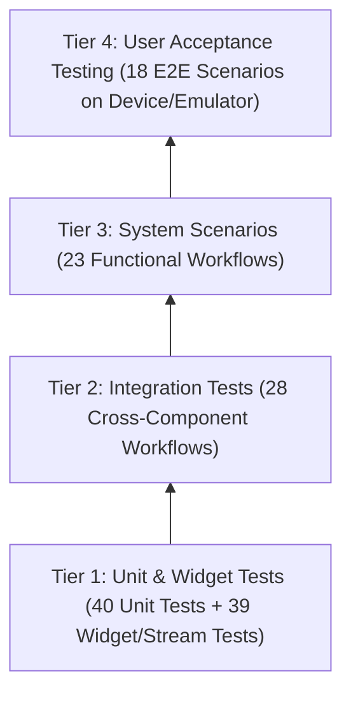

# RUN Campus Connect — Testing, QA & Acceptance Framework

This document details the comprehensive testing strategy, automated test suites, end-to-end integration tests, user acceptance testing (UAT) personas, and the full 109-test-case traceability matrix for **RUN Campus Connect**.

---

## 1. Quality Assurance Architecture

The platform employs a four-tiered testing pyramid:



### Test Directory Layout

```
run_campus_connect/
├── test/                                    # Unit & Widget Test Suites (79 tests)
│   ├── widget_test.dart
│   ├── router/
│   │   ├── auth_redirect_test.dart
│   │   └── auth_redirect_test.mocks.dart
│   ├── core/services/
│   │   ├── birthday_service_test.dart
│   │   ├── birthday_provider_test.dart
│   │   ├── chat_delivery_ack_test.dart
│   │   ├── cloudinary_service_test.dart
│   │   ├── fcm_topic_helper_test.dart
│   │   └── notification_service_test.dart
│   └── features/
│       ├── auth/
│       │   ├── auth_validation_test.dart
│       │   └── login_screen_validation_test.dart
│       ├── chat/
│       │   └── chat_repository_test.dart
│       ├── explore/
│       │   └── explore_controller_test.dart
│       ├── notifications/
│       │   └── notifications_providers_test.dart
│       ├── posts/
│       │   ├── comment_repository_test.dart
│       │   ├── create_post_controller_test.dart
│       │   ├── like_service_test.dart
│       │   ├── post_card_test.dart
│       │   ├── post_creation_test.dart
│       │   ├── post_repository_extended_test.dart
│       │   ├── post_repository_streams_test.dart
│       │   └── post_visibility_test.dart
│       ├── profile/
│       │   └── user_profile_test.dart
│       └── settings/
│           └── settings_controller_test.dart
├── integration_test/                        # On-Device UAT Test Suites (10 files)
│   ├── uat_helpers.dart
│   ├── uat_student_a_test.dart
│   ├── uat_student_b_test.dart
│   ├── uat_no_profile_test.dart
│   ├── uat_notifications_test.dart
│   ├── uat_fresher_test.dart
│   ├── uat_admin_feedback_test.dart
│   ├── uat_verify_email_test.dart
│   ├── uat_birthday_test.dart
│   └── uat_remote_config_test.dart
└── tools/
    └── run_uat_emulator.ps1                 # Automated Device/Emulator Test Runner
```

---

## 2. Test Execution Commands

### 2.1 Running Automated Unit & Widget Tests
```bash
# Run all tests in test/
flutter test

# Run a specific test file
flutter test test/features/posts/post_card_test.dart

# Run with coverage report
flutter test --coverage
```

### 2.2 Regenerating Mockito Mocks
Tests utilize `mockito` with `@GenerateMocks` annotations. When updating mocked interfaces:
```bash
dart run build_runner build --delete-conflicting-outputs
```

### 2.3 Provider Overrides in Widget Tests
In unit and widget tests, Riverpod providers are overridden in `ProviderScope`:
```dart
await tester.pumpWidget(
  ProviderScope(
    overrides: [
      postRepositoryProvider.overrideWithValue(mockPostRepository),
      currentUserProfileProvider.overrideWith((ref) => AsyncData(testProfile)),
    ],
    child: const MaterialApp(home: PostCard(post: samplePost)),
  ),
);
```

---

## 3. Comprehensive 109-Case Testing Matrix

### Legend
- **Pass**: Automated execution verified via `flutter test`.
- **Pass (UAT)**: Verified via automated device/emulator integration suite.
- **Skipped**: Requires physical SMS/OAuth hardware or third-party web console access.

---

### 3.1 Unit Testing Matrix (TC-U-01 to TC-U-40)

| Test ID | Test Scenario | Inputs / Preconditions | Expected Behavior | Status | Test Traceability File |
| :--- | :--- | :--- | :--- | :--- | :--- |
| **TC-U-01** | Reject Non-RUN email domains | `student@gmail.com` | `AuthRepository._isRunEmail` returns `false`; throws `AuthFailure` | Pass | `test/features/auth/auth_validation_test.dart` |
| **TC-U-02** | Accept standard RUN email | `student@run.edu.ng` | Returns `true`; proceeds with authentication | Pass | `test/features/auth/auth_validation_test.dart` |
| **TC-U-03** | Accept fresher synthetic domain | `12345678ab@fresher.run.edu.ng`| Returns `true` (fresher domain recognized) | Pass | `test/features/auth/auth_validation_test.dart` |
| **TC-U-04** | Reject non-RUN university domain | `vc@redeemers.edu.ng` | Returns `false`; throws `AuthFailure` | Pass | `test/features/auth/auth_validation_test.dart` |
| **TC-U-05** | Google sign-in cancellation | `GoogleSignIn.signIn()` returns `null` | Throws `AuthFailure('Google Sign-In was cancelled.')` | Skipped | `test/features/auth/auth_validation_test.dart` |
| **TC-U-06** | Google sign-in non-RUN account | Google account `user@gmail.com` | Signs out Google & Firebase; throws `AuthFailure` | Skipped | `test/features/auth/auth_validation_test.dart` |
| **TC-U-07** | Email login routes to verify email | Valid `@run.edu.ng` creds, `emailVerified == false` | Returns `AuthDestination.verifyEmail` | Pass | `test/features/auth/auth_validation_test.dart` |
| **TC-U-08** | Email login routes to create profile | Valid creds, `users/{uid}` missing | Returns `AuthDestination.createProfile` | Pass | `test/features/auth/auth_validation_test.dart` |
| **TC-U-09** | Refresh email verification unverified | Signed-in user, `emailVerified == false` | Throws `AuthFailure('Please verify your email to continue.')` | Pass | `test/features/auth/auth_validation_test.dart` |
| **TC-U-10** | Fresher signup builds synthetic email | `jambNumber: " 12345678AB "` | Synthetic email `{jamb}@fresher.run.edu.ng`, `isVerified: false` | Pass | `test/features/auth/auth_validation_test.dart` |
| **TC-U-11** | Fresher derives `lastName` | `fullName: "John Ade Okafor"` | Firestore `lastName` = `"Okafor"` | Pass | `test/features/auth/auth_validation_test.dart` |
| **TC-U-12** | Fresher sign-in with pending status | Valid credentials, `isVerified == false` | Returns `AuthDestination.pendingVerification` | Pass | `test/features/auth/auth_validation_test.dart` |
| **TC-U-13** | Verification API failure non-fatal | Python `/verify` unreachable / 500 | Signup completes; logs error; routes to pending | Pass | `test/features/auth/auth_validation_test.dart` |
| **TC-U-14** | LoginScreen email field validator | Empty, invalid domain, valid RUN | Required error; domain error; passes validation | Pass | `test/features/auth/login_screen_validation_test.dart` |
| **TC-U-15** | LoginScreen password validator | Empty, 5 chars, 6+ chars | Required error; min 6 chars error; passes validation | Pass | `test/features/auth/login_screen_validation_test.dart` |
| **TC-U-16** | CreatePost rejects empty post | `content: ""`, `imageFile: null` | `AsyncError('Add some text or attach an image.')` | Pass | `test/features/posts/create_post_controller_test.dart` |
| **TC-U-17** | CreatePost requires profile | Valid content, profile is `null` | Throws `'Complete your profile before posting.'` | Pass | `test/features/posts/create_post_controller_test.dart` |
| **TC-U-18** | PostVisibility fromString fallback | `null`, `""`, `"unknown"`, `"faculty"` | Unknown maps to `public`; valid strings map correctly | Pass | `test/features/posts/post_visibility_test.dart` |
| **TC-U-19** | PostVisibility Firestore serialization | Each enum value | Returns `'public'`, `'faculty'`, `'department'` | Pass | `test/features/posts/post_visibility_test.dart` |
| **TC-U-20** | FcmTopicHelper sanitization | `"Computer Science"`, `"IT & Systems!"` | `"computer_science"`, invalid chars replaced by `_` | Pass | `test/core/services/fcm_topic_helper_test.dart` |
| **TC-U-21** | FcmTopicHelper topic prefixes | Faculty `"Natural Sciences"` | `"faculty_natural_sciences"` and `"department_{slug}"` | Pass | `test/core/services/fcm_topic_helper_test.dart` |
| **TC-U-22** | ChatRepository deterministic ID | `uid1="aaa"`, `uid2="bbb"` and reversed | Always returns `"aaa_bbb"` regardless of arg order | Pass | `test/features/chat/chat_repository_test.dart` |
| **TC-U-23** | LikeService creates like doc | Post not yet liked | Sets `posts/{id}/likes/{uid}`, increments `likeCount` +1 | Pass | `test/features/posts/like_service_test.dart` |
| **TC-U-24** | LikeService removes existing like | Post already liked | Deletes like doc, decrements `likeCount` -1 | Pass | `test/features/posts/like_service_test.dart` |
| **TC-U-25** | PostRepository notification preview | Empty text vs 120-char text | Empty → default text; long text truncated at 90 chars with `…` | Pass | `test/features/posts/post_creation_test.dart` |
| **TC-U-26** | IncrementViewCount excludes author | `viewerUid == authorUid` | No view doc written, `viewCount` untouched | Pass | `test/features/posts/post_repository_extended_test.dart` |
| **TC-U-27** | IncrementViewCount deduplication | Same user views twice | First view increments; second view no-ops | Pass | `test/features/posts/post_repository_extended_test.dart` |
| **TC-U-28** | DeletePost author guard | Non-author UID attempts delete | Throws `'You can only delete your own posts.'` | Pass | `test/features/posts/post_repository_extended_test.dart` |
| **TC-U-29** | Formatted birthday ordinals | `birthDay: 1, 2, 3, 11, 15` | `"October 1st"`, `"2nd"`, `"3rd"`, `"11th"`, `"15th"` | Pass | `test/features/profile/user_profile_test.dart` |
| **TC-U-30** | UserProfile.fromMap null safety | Missing map keys | Missing strings default to `''`, birth fields `null` | Pass | `test/features/profile/user_profile_test.dart` |
| **TC-U-31** | Semantic version comparison | `current: "1.2.3"`, `min: "1.3.0"` | Returns `true`; equal/ahead returns `false` | Pass (UAT) | `integration_test/uat_remote_config_test.dart` |
| **TC-U-32** | APK vs Patch version gap check | `current: "1.0.0"`, `min: "1.0.2"` | Returns `true` (gap ≥ 2 triggers full APK) | Pass (UAT) | `integration_test/uat_remote_config_test.dart` |
| **TC-U-33** | Deterministic rollout bucketing | Fixed UID, `rollout: 50` | Same UID maps to exact same bucket consistently | Pass (UAT) | `integration_test/uat_remote_config_test.dart` |
| **TC-U-34** | Birthday message deduplication | Existing `birthday_flags/{todayKey}` | No second greeting sent | Pass | `test/core/services/birthday_service_test.dart` |
| **TC-U-35** | Birthday check matches today | Profile day/month equals today | Returns `true`; mismatch returns `false` | Pass | `test/core/services/birthday_provider_test.dart` |
| **TC-U-36** | Directory search empty query | Empty string or whitespace | Returns empty list without querying Firestore | Pass | `test/features/explore/explore_controller_test.dart` |
| **TC-U-37** | Directory search deduplication | User matches both first & last | Result array contains user once; max 20 | Pass | `test/features/explore/explore_controller_test.dart` |
| **TC-U-38** | Admin check gate | Matching admin UID / email | Returns `true`; other users `false` | Pass | `test/features/settings/settings_controller_test.dart` |
| **TC-U-39** | Birthday February leap clamp | `month: 2`, `day: 31` | Clamps day to 29 maximum | Skipped | `lib/core/widgets/date_of_birth_picker.dart` |
| **TC-U-40** | CommentRepository unauthenticated | `currentUser == null` | Throws `'You must be signed in to comment.'` | Pass | `test/features/posts/comment_repository_test.dart` |

---

### 3.2 Integration Testing Matrix (TC-INT-01 to TC-INT-28)

| Test ID | Test Scenario | Expected Outcome | Status | Traceability File |
| :--- | :--- | :--- | :--- | :--- |
| **TC-INT-01** | Email registration end-to-end | Auth user created, verification email sent, destination `createProfile` | Pass | `test/features/auth/auth_validation_test.dart` |
| **TC-INT-02** | Email login verified account | Verified user + `users/{uid}` exists → destination `home` | Pass | `test/features/auth/auth_validation_test.dart` |
| **TC-INT-03** | Fresher signup with Cloudinary | Firestore doc created, HTTP POST dispatched to `/verify` | Skipped | `lib/features/auth/data/auth_repository.dart` |
| **TC-INT-04** | Router redirect: unauthenticated deep link | Accessing `/home` logged out redirects to `/` | Pass | `test/router/auth_redirect_test.dart` |
| **TC-INT-05** | Router redirect: missing profile doc | Google user without `users/{uid}` redirects to `/create-profile` | Pass | `test/router/auth_redirect_test.dart` |
| **TC-INT-06** | Router redirect: unverified regular student | `emailVerified == false` redirects to `/verify-email` | Pass | `test/router/auth_redirect_test.dart` |
| **TC-INT-07** | Router redirect: unverified fresher | `role: 'fresher'`, `isVerified == false` redirects to `/pending-verification` | Pass | `test/router/auth_redirect_test.dart` |
| **TC-INT-08** | Router redirect: verified leaves auth pages | Verified user on `/` redirects to `/home` | Pass | `test/router/auth_redirect_test.dart` |
| **TC-INT-09** | Router allow: unauthenticated update center | Navigating to `/update-center` allowed without login | Pass | `test/router/auth_redirect_test.dart` |
| **TC-INT-10** | PostRepository createPost with image | Cloudinary upload called, post written with image URL | Pass | `test/features/posts/post_creation_test.dart` |
| **TC-INT-11** | Faculty-scoped notification fan-out | Notifications created only for same-faculty peers | Pass | `test/features/posts/post_creation_test.dart` |
| **TC-INT-12** | Batch notification chunking at 450 writes | 501 recipients triggers 2 batched commits (450 + 51) | Pass | `test/features/posts/post_creation_test.dart` |
| **TC-INT-13** | Post creation triggers FCM broadcast topic | `NotificationService.sendBroadcastNotification` called | Pass | `test/features/posts/post_creation_test.dart` |
| **TC-INT-14** | PostFeedController pagination | First page 10 posts; `loadMore` appends next page | Pass (UAT) | `test/features/posts/post_repository_extended_test.dart` |
| **TC-INT-15** | PostFeedController faculty stream binding | Subscribes to faculty stream; only matching posts displayed | Pass | `test/features/posts/post_repository_streams_test.dart` |
| **TC-INT-16** | CommentRepository atomic increment | Comment written; parent `commentCount` incremented | Pass | `test/features/posts/comment_repository_test.dart` |
| **TC-INT-17** | ChatRepository sendMessage batch side-effects | Message created; chat metadata updated; recipient unread +1 | Pass | `test/features/chat/chat_repository_test.dart` |
| **TC-INT-18** | ChatRepository ensureChatExists | Opening chat doc preserves `lastTime` and inbox order | Pass | `test/features/chat/chat_repository_test.dart` |
| **TC-INT-19** | ChatRepository markChatAsRead | Unread count in chat reset; global badge decremented | Pass | `test/features/chat/chat_repository_test.dart` |
| **TC-INT-20** | PostRepository deletePost cascade cleanup | Cloudinary delete called; subcollections batch-deleted | Pass | `test/features/posts/post_repository_extended_test.dart` |
| **TC-INT-21** | FCM initialize on login | Token saved; subscribed to `global`, faculty, and dept topics | Skipped | `lib/core/services/fcm_service.dart` |
| **TC-INT-22** | SettingsController performCleanLogout | Presence stopped, FCM token deleted, caches cleared | Skipped | `lib/features/settings/presentation/settings_controller.dart` |
| **TC-INT-23** | Feedback submission admin push | Feedback doc created; push sent to `adminFeedbackUid` | Skipped | `lib/features/settings/presentation/settings_controller.dart` |
| **TC-INT-24** | FilteredNotifications category streams | Emits only notifications matching the active tab | Pass | `test/features/notifications/notifications_providers_test.dart` |
| **TC-INT-25** | UnreadBadgeProvider stream | Streams `users/{uid}.totalUnreadMessages` count | Pass | `test/features/notifications/notifications_providers_test.dart` |
| **TC-INT-26** | CreateProfile form persistence | Form submits to `users/{uid}`; router allows `/home` | Pass (UAT) | `integration_test/uat_no_profile_test.dart` |
| **TC-INT-27** | UpdateCheckWrapper + Remote Config | Version below `min_version` prompts update gate | Pass (UAT) | `integration_test/uat_remote_config_test.dart` |
| **TC-INT-28** | NotificationService auth header | HTTP POST to Vercel includes Bearer Firebase ID token | Pass | `test/core/services/notification_service_test.dart` |

---

### 3.3 System & End-to-End Scenarios (TC-SYS-01 to TC-SYS-23)

| Test ID | System Scenario | Validation Method | Status |
| :--- | :--- | :--- | :--- |
| **TC-SYS-01** | Student onboarding (Register → Verify → Create Profile) | Automated Integration Suite | Pass (UAT) |
| **TC-SYS-02** | Returning student login and session persistence | Automated Integration Suite | Pass (UAT) |
| **TC-SYS-03** | Google Sign-In with `@run.edu.ng` | Manual Device Testing | Skipped |
| **TC-SYS-04** | Fresher end-to-end registration & admin approval | Automated Integration Suite | Pass (UAT) |
| **TC-SYS-05** | Fresher sign-in while pending verification | Automated Integration Suite | Pass (UAT) |
| **TC-SYS-06** | Tri-tab home feed scoping (Global / Faculty / Dept) | Automated Integration Suite | Pass (UAT) |
| **TC-SYS-07** | Create post with image and faculty visibility | Automated Integration Suite | Pass (UAT) |
| **TC-SYS-08** | Real-time post like and unlike | Automated Integration Suite | Pass (UAT) |
| **TC-SYS-09** | Threaded comments submission & counter updates | Automated Integration Suite | Pass (UAT) |
| **TC-SYS-10** | Cascade deletion of author's post | Automated Integration Suite | Pass (UAT) |
| **TC-SYS-11** | Directory search by first/last name | Automated Integration Suite | Pass (UAT) |
| **TC-SYS-12** | Direct message initiation from user profile | Automated Integration Suite | Pass (UAT) |
| **TC-SYS-13** | Chat replies, quote previews, and delivery ticks | Automated Integration Suite | Pass (UAT) |
| **TC-SYS-14** | FCM topic push broadcast on new post | Cloud / Physical Hardware | Skipped |
| **TC-SYS-15** | Direct message incoming push alert | Cloud / Physical Hardware | Skipped |
| **TC-SYS-16** | Notification center category tab filtering | Automated Integration Suite | Pass (UAT) |
| **TC-SYS-17** | Profile edit and dark mode persistence | Automated Integration Suite | Pass (UAT) |
| **TC-SYS-18** | Institutional explore content & webview fallback | Automated Integration Suite | Pass (UAT) |
| **TC-SYS-19** | Birthday bot message dispatch | Automated Integration Suite | Pass (UAT) |
| **TC-SYS-20** | Forced app update gate via Remote Config | Automated Integration Suite | Pass (UAT) |
| **TC-SYS-21** | Clean logout and user session switch | Automated Integration Suite | Pass (UAT) |
| **TC-SYS-22** | Admin feedback list & status updates | Automated Integration Suite | Pass (UAT) |
| **TC-SYS-23** | Offline mode network resilience | Network disconnect simulation | Skipped |

---

### 3.4 User Acceptance Testing Matrix (TC-UAT-01 to TC-UAT-18)

| Test ID | User Story / Acceptance Criteria | Automated UAT Test File | Status |
| :--- | :--- | :--- | :--- |
| **TC-UAT-01** | Student blocked when using personal Gmail | `integration_test/uat_student_a_test.dart` | Pass |
| **TC-UAT-02** | New student creates profile with valid faculty/dept | `integration_test/uat_no_profile_test.dart` | Pass |
| **TC-UAT-03** | Student searches and connects with peers | `integration_test/uat_student_a_test.dart` | Pass |
| **TC-UAT-04** | Department post visible only to department peers | `integration_test/uat_student_b_test.dart` | Pass |
| **TC-UAT-05** | Student likes peer's post in feed | `integration_test/uat_student_b_test.dart` | Pass |
| **TC-UAT-06** | Student receives in-app notifications and unread badge | `integration_test/uat_notifications_test.dart`| Pass |
| **TC-UAT-07** | Private messaging with read/delivery receipts | `integration_test/uat_student_a_test.dart` | Pass |
| **TC-UAT-08** | Fresher registers with JAMB and documents | `integration_test/uat_fresher_test.dart` | Pass |
| **TC-UAT-09** | Verified fresher gains full application access | `integration_test/uat_fresher_test.dart` | Pass |
| **TC-UAT-10** | Student reads university history, governance, contacts | `integration_test/uat_student_a_test.dart` | Pass |
| **TC-UAT-11** | Student switches theme mode (Dark/Light) | `integration_test/uat_student_a_test.dart` | Pass |
| **TC-UAT-12** | Student submits app feedback form | `integration_test/uat_student_a_test.dart` | Pass |
| **TC-UAT-13** | Administrator reviews and triages feedback | `integration_test/uat_admin_feedback_test.dart`| Pass |
| **TC-UAT-14** | Student performs secure clean logout | `integration_test/uat_student_a_test.dart` | Pass |
| **TC-UAT-15** | App update gate detects outdated versions | `integration_test/uat_remote_config_test.dart` | Pass |
| **TC-UAT-16** | Birthday recognition greeting delivered once per day | `integration_test/uat_birthday_test.dart` | Pass |
| **TC-UAT-17** | Student cannot delete peer's post | `integration_test/uat_student_b_test.dart` | Pass |
| **TC-UAT-18** | Email verification enforced before main feed access | `integration_test/uat_verify_email_test.dart` | Pass |

---

## 4. Automated UAT Test Runner Script

To execute the automated end-to-end UAT integration tests on a connected device or emulator with automated state clearing between test blocks:

```powershell
cd run_campus_connect

# Run on automatically detected device/emulator
powershell -ExecutionPolicy Bypass -File tools/run_uat_emulator.ps1

# Specify a target device ID
powershell -ExecutionPolicy Bypass -File tools/run_uat_emulator.ps1 -DeviceId emulator-5554

# Automatically launch the Pixel 9 Pro XL emulator first
powershell -ExecutionPolicy Bypass -File tools/run_uat_emulator.ps1 -LaunchEmulator
```

### Script Execution Lifecycle (`run_uat_emulator.ps1`)
1. Detects connected Android hardware or emulators via `flutter devices`.
2. Seeds test accounts into Firebase via `python python_backend/scripts/seed_uat_accounts.py`.
3. Sequentially executes each UAT test suite in `integration_test/`.
4. Executes `adb shell pm clear com.run.campus_connect` between test blocks to ensure a clean, isolated application state.
